# Quick Reference

### 1.Welcome to C#

1.1 Create a new **console application** using Visual Studio 2017

> ​	File - New - Project(Ctrl+Shift+N)
>
> ​	Select `Console App(.NET Framework)`

1.2 Create a new Universal Windows app

> ​	File - New - Project(Ctrl+Shift+N)
>
> ​	Select `Blank App (Universal Windows)`

1.3 Build the application

> ​	Build - Build Solution(Ctrl+Shift+B)

1.4 Run the application in debug mode

> ​	Debug - Start Debugging(F5)

1.5 Run the application without debugging

> ​	Debug - Start without debugging(Ctrl+F5)


### 2.Variables, operators, and expressions

2.1 Declare a variable

> ​	The code of declaration is in the following order:
>
> ​	data type -> variable name -> semicolon
>
> ​	`[type] [name];`
>
> ​	`int year;`

2.2 Declare a variable and give it an initial value

> ​	data type -> variable name -> assignment operator -> initial value -> semicolon
>
> ​	`[type] [name] = [value];`
>
> ​	`int year = 2021;`

2.3 Change the value of a variable

> ​	variable name -> assignment operator -> expression calculating the new value(right hand side)
>
> ​	`[name] = [right hand side]`
>
> ​	`year = 2020;`

2.4 Generate a string representation of the value in a variable

> ​	Using `To.String()` method

```c#
int intVar = 13;
string strVar = intVar.ToString.();
```

2.5 Convert a `string` to an `int/double`

> ​	Using `System.Int32.Parse` or `System.Double.Parse`
>
> ​	`int.Parse` and `double.Parse` for short

```c#
string strPI = "3.14159";
string strThirdteen = "13";
double dPI = double.Parse(strPI);
int thirdteen = int.Parse(strThirdteen);
```

2.6 Override the precedence of an operator

> ​	a.k.a. value inside the bracket computed first
>
> ​	`(3 + 5) * 2`

2.7 Assign the same value to several variables

> ​	the value is passed from right to left

```c#
int myInt4, myInt3, myInt2, myInt;
myInt4 = myInt3 = myInt2 = myInt = 10;
```

2.8 Increment or decrement a variable

> ​	using `++` or `--`
>
> ​	e.g.	`count++;`


### 3.Methods and applying scope

3.1 Declare a method

> ​	write inside the class

```
[return type] [method name] (date_type value1, data_type value2)
{
	//
}
```

> ​	e.g  :

```c#
int addValue(int leftHandSide, int rightHandSide)
{
    //
}
```

3.2 Return a value from within a method

> ​	use `return` key word

```c#
int addValue(int leftHandSide, int rightHandSide)
{
    return leftHandSide + rightHandSide;
}
```

> ​	Tips: even though you don't have to include a `return` at the end of a `void` function, it is suggested to do so. Since every method should return somethin. `void` method `return` void.

```c#
public void Method()
{
	//do something here...
    return;
}
```

3.3 Return multiple values from within a method

> ​	return multiple values as a tuple

```c#
(int min, int max) FindMinMax(int[] input)
{
	// finding min and max
    return (min, max);
}
```

> ​	then the function returned multiple values can be used like this:

```c#
var input = new[] { -9, 0, 67, 100 };
var (minimum, maximum) = FindMinMax(input);
```

3.4 Return from a method before the end of the method

> ​	nothing special, but to remember, to block ends at where `return` is.

```c#
void PrintSomething()
{
    Console.WriteLine("1");	// √
    Console.WriteLine("1");	// √
    return;
    Console.WriteLine("3");	// x(this won't be printed.)
}
```

3.5 Define an expression bodied method

> ​	a.k.a. it just replace the `{}` and `return` by using `=>`

```c#
double CalculateFee(double dailyRate, int days)
{
    return dailyRate * days;
}
```

> ​	it will be:

```c#
double CalculateFee(double dailyRate, int days) => dailyRate * days;
```

3.6 Call a method

> ​	nothing special, just put the `methodName(argument1, argument2, ...);`

```c#
addValues(39, 3);
```

3.8 Use the Generate Method Stub Wizard

> ​	double click the method, right click, `Quick Action and Refactoring`(Ctrl+,)

3.9 Create a nested method( method in method )

> ​	as you can see there is a method `factorial` inside the method `CalculateFactorial`.

```c#
long CalculateFactorial(string input)
{
    //...
    long factorial(int dataValue)
    {
        if (dataValue == 1)
        {
            return 1;
        }
        else
        {
            return dataValue * factorial(dataValue - 1);
        }
    }
}
```

3.10 Display the Debug toolbar

> ​	anytime you can't find the icon of your tool. Go to **View - Toolbar** ...
>
> ​	in this case, **View - Toolbar - Debug**

3.11 Step into a method

> ​	

3.12 Step out of a method

3.13 Specify an optional parameter to a method

> ​	nothing special, just give an initial value when you define it

```c#
void optMethod(int first, double second = 0.0, string third = "Hello")
{
    //...
}
```

3.14 Pass a method argument as a named parameter

> ​	Since you already have some default argument, you don't want to assign it again...

```c#
optMethod(first: 100, third: "World");
```

> ​	as you can see, you can skip typing something for `second`.


### 4.Decision statements

4.1`==`, `!=` determine equivalent

```c#
thisYear == 2021;
```

4.2`>, >=, <, <=`Compare the value of two expressions

```c#
bool flag = 13 > 23;
```

4.3Declare a Boolean variable

```c#
bool isOdd;
```

4.4`AND` true

> ​	use `&&`

```c#
inRange = (lo <= number) && (number <= hi);
```

4.5`or` true

> ​	use `||`

```c#
outOfRange = (number < lo) || (hi < number);
```

4.6`if` statement

> ​	in short(not recommend)::x:

```c#
if (inRange)
	process();
```

> ​	complete written(recommend)::heavy_check_mark:

```c#
if (inRange)
{
    process;
}
```

4.7`switch` statement

> ​	it is sort of a gate, which controls the output

```c#
int choice;
switch(choice)
{
    case 0:
        //do something (if choice== 0)
        break;    
    case 1:
        //do something (if choice== 1)
        break;    
    default:
        //do something (if (choice !==0 && choice!=1))
        break;
}
```

> ​	tips: always leave `default` value


### 5.Compound assignment and iteration statements

5.1What is compound assignment

> ​	It is a shortcut for arithmetic operation and assignment.

```c#
variable += 13;  //equivalent to variable = variable + 13;
variable -= 10;  //equivalent to variable = variable - 13;
variable *= 13;  //equivalent to variable = variable * 13;
variable /= 13;  //equivalent to variable = variable / 13;
```

> ​	However, if there is multiple variable on the right hand side. I personally not recommend this shortcut.

5.2`while` loop

> ​	`while` something is `true`, do something

```c#
int i = 0;
while(i < 10)
{
    Console.WriteLine(i);
    i++;  //Please don't forget increment the condition!
}
```

5.3`for` loop

> ​	`[local variable]; [termination condition]; [incrementation(sometimes decrease)]`

```c#
for (int i = 0; i < 10; i ++)
{
    Console.WriteLine(i);
}
```

> ​	sometimes you can iterate backward or increment based on 2

```c#
for (int i = 10; i > 0; i--)
{
    //do something...
}
for (int i = 0; i < 10; i+=2)
{
    //do something...
}
```

5.4`do-while` loop

> ​	the difference between `do-while` loop and `while` loop is that: **`do-while` loop iterate at least once.**

```c#
int i = 0;
do
{
    Console.WriteLine(i);
    i++;
}
while(i < 10);
```


### 6.Errors and exceptions

6.1 Catch a specific exception

> ​	if you want to catch **specific** exception, you have to specify the type of exception

```c#
try
{
    //do something...
}
catch(FormatException fEx)
{
    //do something...
}
```

> ​	in convention, we denote `exception` to be `??Ex`

6.4 Catch all types of exceptions with one call

> ​	use `Exception` to cover all types of exception

```c#
try
{
    //do something...
}
catch(Exception ex)
{
    //do something...
}
```

6.2 Use `checked` to prevent overflow

> ​	 this is very handy in arithmetic computation for it prevent overflow

```c#
int number = Int32.MaxValue;
checked {number++};  //in this case, the overflow error will be caught
```

6.3 Throw an exception

> ​	use `throw` keyword

```c#
throw new FormatException(source);
```

6.4 Ensure code will always run even though with an exception

> ​	this is very handy

```c#
try
{
    //do something..
}
finally
{
    //this will be run no matter there is an exception above
}
```


### 7.Class and objects

7.1 Declare a `class`

```c#
class className
{
    //..
}
```

7.2 Declare a `constructor`

> ​	Write a method whose name is the same as the name of the class, and that **has no return type**

```c#
class Point
{
    //..place the field at here
    public Point(int x, int y)
    {
        //..
    }
}
```

7.3 Call a `constructor`

> ​	Use the `new` keyword and specify the constructor with an **appropriate set of parameters**

```c#
Point origin = new Point(10, 10);
```

7.4 Declare a `static` method

> ​	use the `static` keyword;  a `static` method is that you can call this method without initializing an instance of this class.

```c#
class Point
{
    //...
    public static int ObjectCount()
    {
        //...
    }
}
```

7.5 Call a `static` method

> ​	to call a `static` method, just : `[ClassName].[staticMethodName]`

```c#
int pointsCreatedSoFar = Point.ObjectCount();
```

7.6 Declare and acess a `static` field

```c#
class Point
{
    //...
    public static int ObjectCount;
}
```

> ​	and you can acess the static field by invoke it directly

```c#
int num = Point.ObjectCount;
```

7.7 Declare a `const` field

> ​	`const` is a constant value

```c#
class Math
{
    //...
    public const double PI = 3.14159;
}
```


### 8.Values and references

8.1 Copy a **value type** variable

> ​	when you copy value type, there are two distinct copies

```c#
int i = 13;
int copyi = i;
i++; //the change won't affect `copyi`
```

8.2 Copy a **reference type** variable

> ​	when you copy a reference type, you actually copied the `reference` of the variable

```c#
Curve arcCrv = new Curve();
Curve crv = arcCrv;
arcCrv.Translate();  //this not only translates `arcCrv` but also `crv`.
```

8.3 Declare a variable that can hold a value type or the `null` value

> ​	use `?` modifier

```c#
int? i = null;
```

8.4 Pass an argument to a `ref` parameter

> ​	the key word `ref` simply implies that the change will affect itself

```c#
static void doIncrement(ref int number)
{
    number++;
}
int i = 42;
doIncrement(ref i);  //i is changed
```

> ​	although the function `doIncrement` is a `void` function which returns nothing, 
>
> ​	we should pay attention to `ref` keyword. In this case, the `i` was incremented.

8.5 Pass an argument to an `out` parameter

> ​	it is very similar to `ref` keyword, my way to perceive this is that whenever you see `out`,
>
> ​	it is a decoration for output, you have to *prepare something for the output*.

```c#
using System.Linq;
static void duplicateTenTimes(int i, out List<int> duplicatedList)
{
    duplicatedList = Enumerable.Repeat(i, 10).ToList();
}

List<int>tenDuplicate = new List<int>();
duplicateTenTimes(10, out tenDuplicate); //at this point, the `tenDuplicate` has 10 copies of 10.
```

8.6 Box and unbox a value

> ​	you can see `box` as a way wrapping anything to a generic type, 
>
> ​	in this case we use `object`

```c#
object o = 42;
```

> ​	respectively, you can see `unbox` as way casting the generic type to specific type

```c#
int i = (int)o;
```

8.8 Cast an object safely

> ​	1.First choice, use `is` keyword to check if the cast success

```c#
WrappedInt wi = new WrappedInt();
//...
object o = wi;
if (o is WrappedInt temp)
{
	//...
}
```

> ​	2.Second choice, use `as` to perform the cast, and check if it is `null`

```c#
WrappedInt wi = new WrappedInt();
//...
object o = wi;
WrappedInt temp = o as WrappedInt;
if (temp != null)
{
    //...
}
```


### 9.Enumerations and structures

:star: Remember, the biggest difference between `struct` and `class` is that: **Structs are value type** whereas **Classes are reference type**.

9.1 Declare an enumeration

> ​	use the `enum` keyword => name of this `enum` => enumeration **literal** names

```c#
enum Days {Sunday, Monday, Tuesday, Wednesday, Thursday, Friday};
```

9.2 Declare an enumeration variable

```
Days today;
```

9.3 Assign an enumeration variable to a value

```c#
today = Sunday;		//WRONG!! on the rhs, the compiler can't detect what is "Sunday" literally.
today = Days.Sunday;//Correct.
```

9.4 Declare a structure type

> use the keyword `struct` => the name of the `struct` =>  the body of the `struct` (the constructors, methods, and fields).  [similar to class]

```c#
struct Point3d
{
    internal double _x, _y, _z;
    public Point3d(double x, double y, double z)
    {
        this._x = x;
        this._y = y;
        this._z = z;
    }
}
```

9.5 Declare a structure variable

```c#
Point3d pt;
```

9.6 Initialize a structure variable to a value

> ​	nothing special, similar to `class`

```c#
Point3d = new Point3d(0, 1, 2);
```


### 10.Arrays

> ​	:star: What is the biggest difference betweem `Array` and `List`?
>
> ​			`Array` is fixed size once it is initialized. `List` is dynamic, you can `either` add or `remove` items from it.

10.1 **Declare** an array variable

> ​	[data_type] [name_of_array];

```c#
bool[] flags;
```

10.2 **Create an instance** of an array

> ​	when you create an **instance**, you have to explicitly define the amount of the array.

```c#
bool[] flags = new bool[10];
```

10.3 **Initialize** the elements of an array to specific values

> ​	when you **initialize** the array, you have to assign specific values

```c#
int[] numPI = {3, 1, 4, 1, 5, 9};
```

10.4 Find how many elements in an array

> ​	use `Length` property

```c#
int[] numPI = {3, 1, 4, 1, 5, 9};
int numPIAmount = numPI.Length;  //here you got 6
```

10.5 Access a single array element

> ​	use the `[]` to access particular element

```c#
int num = numPIAmount[2];  //here you got 4
```

10.6 Loop over an array

> ​	use `for` loop or `foreach` loop

```c#
bool[] flags = { true, false, true, false };
for (int i = 0; i < flags.Length; i++)
{
    Console.WriteLine(flags[i]);
}
foreach (bool flag in flags)
{
    Console.WriteLine(flag);
}
```

10.7 Declare a **multidimensional array** variable

> ​	use something like this `[,]`

```c#
int[,] table;
table = new int[4, 6];  //initialize an 4*6 array
```

10.8 Declare a **jagged array** variable

> ​	use something like this `[][]`

```c#
int[][] items;
items = new int[4][];
items[0] = new int[3];
items[1] = new int[10];
items[2] = new int[40];
items[3] = new int[25];
```

:star: Intuitively, the difference between *multidimensional array* and *jagged array* is that the

*multidimensional array* is like a **square** with anything aligned.

*jagged array* is like zig-zag **non-symmetric shape**.

```c#
public class ArrayHolder
{
    int[,] multiDimArray =  {{1,2,3,4},
                             {5,6,7,0},
                             {8,0,0,0},
                             {9,0,0,0}
                            };
    int[][] jaggedArray = { new int[] {1,2,3,4},
                            new int[] {5,6,7},
                            new int[] {8},
                            new int[] {9}
                          };
}
```


### 11.Parameter arrays

> ​	By using the `params` keyword, you can specify a [method parameter](https://docs.microsoft.com/en-us/dotnet/csharp/language-reference/keywords/method-parameters) that takes **a variable number of arguments**. :warning: However, the parameter type **must be a single-dimensional array**.

```c#
public class MyClass
{
    public static void IntParams(params int[] list)  //with `params` keyword, the length of array can be dynamic
    {
        for (int i = 0; i < list.Length; i++)
        {
            Console.Write(list[i] + " ");
        }
        Console.WriteLine();
    }
    public static void objParams(params object[] list)
    {
        for (int i = 0; i < list.Length; i++)
        {
            Console.Write(list[i] + " ");
        }
        Console.WriteLine();
    }

    static void Main()
    {
        //output: 1 2 3 4
        IntParams(1, 2, 3, 4);
        
        //output: 1 a test
        objParams(1, 'a', "test");

        //output: a blank line
        objParams();

        //output: 5 6 7 8 9
        int[] myIntArray = { 5, 6, 7, 8, 9 };
        IntParams(myIntArray);  //the length can be varied

        //output: 2 b test again
        object[] myObjArray = { 2, 'b', "test", "again" };
        objParams(myObjArray);  //you can pass different types elements in it

        // output: error!!! no output!!
        IntParams(myObjArray);  //this cannot be compiled
        
        //output: System.Int32[]
        objParams(myIntArray);  // No error, but!! the entire integer array becomes the 1st element of the params array.
    }
}
/*
Output:
    1 2 3 4
    1 a test

    5 6 7 8 9
    2 b test again
    System.Int32[]
*/
```


### 12.Inheritance

12.1 Create a derived class from a base class

> ​	use the colon `:`

```c#
class BaseClass
{
    public BaseClass(int x, int y)
    {
        //ctor...
    }
}

class DerivedClass : BaseClass
{
	public DerivedClass(int x, int y) : base(x, y)
    {
    }
    // if you want to inherit the constructor from the BaseClass,
    // then you don't need to write the code here, leave it blank.
}
```

12.2 Declare a `virtual` method in the `base` class and `override` it in the `derived` class

> ​	Remember:
>
> ​				`virtual` in the `base` class
>
> ​				`override` in the `derived` class

```c#
class Mammal
{
    public virtual void Breathe()
    {
    	//the general method for Mamml
    }
	//...
}

class Whale : Mammal
{
    public override void Breathe()
    {
    	//override the breathe method rather than using the general breathe
    }
	//...
}
```

12.3 Define an extension method for a type

> ​	:question: What is `extension method` in the first place? 
>
> ​			It is the `.` method you use everyday! Like `.Select()`, `.ToString()`, `.OrderBy()`.
>
> ​	:star: To conclude, the `extension method` is a **static method** which **extends** some sort of method by invoke the dot `.`
>
> ​	For example, I can write my own `countStringLength` method by decorating the `variable` with **this**.:star2::star2:
>
> ​	:question: What is `this` keyword? 
>
> ​	The `this` keyword refers to **the current instance of the class** and is also used as a modifier of the first parameter of an extension method.

```c#
namespace ExtensionMethods
{
    static class Util
    {
        public static int Negate(this int i)
        {
        	return -i;
        }
    }
}
```

> ​	so you see `this String str` is decorated with `this`, which means the variable can be the current instance of the class!!

```c#
using ExtensionMethods;  //bring the Extension method here
//...
int ten = 10;
int nine = ten.Negate();  //now you can use `.Negate()` method without writing this method inside a class
```


### 13.Interfaces and abstract classes

:star: the concept of `interface` is a little bit similar to `.header` file in C++, which is **a must for such class to implement it**.

13.1 Declare an interface

> ​	use `interface` keyword

```c#
interface IDemo
{
    string GetName();
	string GetDescription();
}
```

13.2 Implement an interface

> ​	implement the class to fulfill interface **explicitly**

```c#
class Test : IDemo
{
    public string IDemo.GetName()
    {
    	//...
    }
    public string IDemo.GetDescription()
    {
    	//...
    }
}
```

> ​		implement the class to fulfill interface **implicitly**

```c#
class Test : IDemo
{
    public string GetName()
    {
    	//...
    }
    public string GetDescription()
    {
    	//...
    }
}
```

13.3 `abstract` class which **can only be a base class**

> ​	use the `abstract` keyword. **You cannot create an instance from an abstract class**.
>
> ​	:question: OK, so what is the purpose to create an `abstract` class?
>
> ​	:star:It means **to be a template**. For example, you define a class call `Felidae猫科动物`, but `Felidae` should be treated as a family of mammals! There 		is no 	such instance of `Felidae`.

```c#
abstract class Felidae
{
    //...
    public virtual void Sound();
}

public class Cat : Felidae
{
    //...
    public override void Sound()
    {
        Console.WriteLine("Meow Meow~");
    }
}
```

13.4  A `sealed` class that **cannot be a base class**

```c#
sealed class Horse
{
    //...
}
```


### 14.Garbage collection and resource management

14.1 Write a destructor

> ​	use the `~` prefix. In the meantime, the method of destructor can't have access modifier!!(such as `public`)

```c#
class Example
{
    //..
    ~Example()
    {
    }
}
```

14.2 Call the destructor is invalid

> You can’t call a destructor. **Only the garbage collector can call a destructor**.

14.3 :x:Force garbage collection (**not recommended**)

```c#
GC.Collect;
```

14.4 Release a resource at a known point in time

> :warning:cons: this is at the risk of resource leaks if an exception interrupts the execution
>
> How to do it? => Write a **disposal method** (a method that disposes of a resource) and **call it explicitly** from the program.

```c#
class TextReader
{
    //...
    public virtual void Close()
    {
    	//write the disposal method here
    }
}
class Example
{
    void Use()
    {
        TextReader reader = ...;
        
        reader.Close();  // call it explicitly to dispose a resource
    }
}
```

14.5 Support exception-safe disposal in a class

> ​	that said, to implement the `IDisposable` interface

```c#
class SafeResource : IDisposable
{
	//...
    public void Dispose()
    {
    // Dispose resources here
    }
}
```

14.6 Implement exception-safe disposal for an object that implements the `IDisposable` interface

> ​	:star: This is the recommended option in garbage collection.
>
> ​	How to do that? => Create the object in a `using` statement

```c#
using (SafeResource resource = new SafeResource())
{
    // Use SafeResource here
    // ...
}
```


### 15.Properties

:star: Big picture: The design of property in C# is to inherit the `get()` and `set()` method in C++, but in an efficient, elegant and safe way.

15.1 Declare a read/write `property` for a structure or class

> ​	define the `type` of that property with `get` and `set`
>
> ​	`get`: able to read
>
> ​	`set`: able to write

```c#
struct ScreenPosition
{
	//...
    public int X
    {
        get { ... } // or get => ...
        set { ... } // or set => ...
    }
    //...
}
```

> ​	property with only `get` keyword is **read-only**
>
> ​	property with only `set` keyword is **write-only**

15.2 Declare a property in an `interface`

> ​	just write down the `get` and `set`

```c#
interface IScreenPosition
{
    int X { get; set; }
    int Y { get; set; }
}
```

> ​	the class implemented the interface will look like this:

```c#
struct ScreenPosition : IScreenPosition
{
    private int _x;
    private int _y;
    
    public int X
    {
        get => this._x;
        set => this._x = value;
    }
    public int Y
    {
        get => this._y;
        set => this._y = value;
    }
}
```

15.3 Create an automatic property

> ​	In the class or structure that contains the property, define the property with empty `get` and `set` accessors.
>
> :heavy_check_mark:This is a very handy feature!

```c#
public class Customer
{
    public int Id { get; set; }
    public string FirstName { get; set; }
    public string LastName { get; set; }
}
```

> ​	now this class can be used as a sort of data container!!

```c#
var customerBob = new Customer
{
    Id = 1,
    FirstName = "Bob",
    LastName = "Smith"
}
var customerDavid = new Customer
{
    Id = 3,
    FirstName = "David",
    LastName = "Rutten"
}
```


### 16.Indexers

:star: Big picture: What is the purpose of indexer?

​				It aims to **deconstruct the integer to binary value**(`1/0` and `true/false`) which is very **flexible**!

:pushpin:Fun fact: What the heck is integer, binary, hex, etc?

​				We use `decimal system十进制` in our daily life, e.g. "I am `26` years old." In the following context, the `hex`, `binary` are all another form, so to speak, of `decimal system`. Nothing special, that is it. `hexadecimal 十六进制` is 16-base. `binary` is 2-base.

16.1 Specify an integer value using binary or hexadecimal notation

> `0b0` for **binary** values prefixes.
>
> `0x0` for **hexadecimal** values prefixes. 
>
> Include `_` separators to make values easier to read.

```c#
uint moreBinData = 0b0_11110000_01011010_11001100_00001111;
uint moreHexData = 0x0_F0_5A_CC_0F;
```

16.2 Display an integer value as its binary or hexadecimal representation

> ​	Use the `Convert.ToString()` method, and specify 2 (for binary) or 16 (for hexadecimal) as the number base.

```c#
uint moreHexData = 0x0_F0_5A_CC_0F;
Console.WriteLine($"{Convert.ToString(moreHexData, 2)}");
// displays 11110000010110101100110000001111
// so `0x0_F0_5A_CC_0F` is `11110000010110101100110000001111` although they are in different base.
```

16.3 Create an indexer for a class or structure

> ​	use the keyword `this` and **square bracket `[]`**

```c#
struct RawInt
{
    //...
    public bool this [ int index ]
    {
        get { ... }
        set { ... }
    }
    //...
}
```

16.4 Define an indexer in an interface and implement it

> ​	define it:

```c#
interface IRawInt
{
	bool this [ int index ] { get; set; }
}
```

> ​	**implicitly** implement it:

```c#
struct RawInt : IRawInt
{
    //...
    public bool this [ int index ]
    {
        get { ... }
        set { ... }
    }
    //...
}
```

> ​	**explicitly** implement it:

```c#
struct RawInt : IRawInt
{
    //...
    bool IRawInt.this [ int index ]
    {
        get { ... }
        set { ... }
    }
    //...
}
```


### 17.Generics

17.1 Instantiate an object by using a generic type

> ​	when you see `<>` , it means this is used in a generic way

```c#
Queue<int> myQueue1 = new Queue<int>();
Queue<double> myQueue2 = new Queue<double>();
Queue<string> myQueue3 = new Queue<string>();
List<int> myList1 = new List<int>();
List<double> myList2 = new List<double>();
List<string> myList3 = new List<string>();
```

> ​	as you can see, the `Queue` can contain `int`, `double`, and `string` etc. That is due to the design of `Queue` and `List`
>
> ​	:star:it use `T` notated as **generic**.

```c#
public class Queue<T> : IEnumerable<T>, ICollection, IEnumerable
{
    //...
}
public class List<T> : IList<T>, ICollection<T>, IList, ICollection, IReadOnlyList<T>, IReadOnlyCollection<T>, IEnumerable<T>, IEnumerable
{
    //...
}
```

17.2 Create a new generic type

```c#
public class Tree<T>
{
 	//...   
}
```

17.3 :star:**Restrict** the type **that can be substituted** for the generic type parameter

> ​	It means that if you want to use this generic formwork, the data-type you set my implement something.
>
> ​	The following means the `T` in the `Tree` must implement `IComparable<T>`

```c#
public class Tree<T> where T : IComparable<T>
{
	//...
}
```

17.4 Define a generic method

> ​	put `<T>` before the `()`

```c#
static void InsertIntoTree<T>(Tree<T> tree, params T[] data)
{
    //...
}
```

17.5 Invoke a generic method

> ​	just put the data type you use to replace the `T`

```c#
InsertIntoTree<char>(charTree, 'Z', 'X');
```

17.6 Define a **covariant** interface

> ​	Specify the `out` qualifier for covariant type parameters. Reference the covariant type parameters only as the return types from methods and not as 	the types for method parameters:

```c#
interface IRetrieveWrapper<out T>
{
	T GetData();
}
```

17.7 Define a **contravariant** interface

> ​	Specify the `in` qualifier for contravariant type parameters. Reference the contravariant type parameters only as the types of method parameters and 	not as return types:

```c#
public interface IComparer<in T>
{
	int Compare(T x, T y);
}
```


:pushpin: A note on `T`. Here the `T` is literal symbol of `Generic`. What really does represent `Generic` is `< >`. See the following example:

```c#
public class Tree<T>
{
 	//...   
}
public class Tree<TItem>
{
 	//...   
}
```

They are the same in functionality no matter used `T` or `TItem`. I personally prefer `T` for simplicity.


### 18.Collections

> ​	The frequently used collections in C# are:
>
> 	- 

18.1 Create a new collection

> ​	use `List<T>` as an example

```c#
List<PlayingCard> cards = new List<PlayingCard>();
```

18.2 Add an item to a collection

> ​	`List<T>` use `Add`
>
> ​	`HashSet<T>` use `Add`
>
> ​	`Dictionary<T,T>` use `Insert`
>
> ​	`Queue<T>` use `Enqueue`
>
> ​	`Stack<T>` use `Push`

```c#
HashSet<string> employees = new HashSet<string>();
employees.Add("John");

LinkedList<int> data = new LinkedList<int>();
data.AddFirst(101);

Stack<int> numbers = new Stack<int>(); numbers.Push(99);
```

18.3 Remove an item from a collection

> ​	 `Remove` is used in `List<T>`, `HashSet<T>`, `Dictionary<T, T>`
>
> ​	 `Dequeue` is used in `Queue<T>`
>
> ​	 `Pop` is used in `Stack<T>`

```c#
HashSet<string> employees = new HashSet<string>();
//..
employees.Remove("John");

LinkedList<int> data = new LinkedList<int>();
//..
data.Remove(101);

Stack<int> numbers = new Stack<int>();
//..
int item = numbers.Pop();
```

18.4 Find the number of elements in a collection

> ​	use `Count`

```c#
List<PlayingCard> cards = new List<PlayingCard>();
//...
int noOfCards = cards.Count;
```

18.5 Locate an item in a collection

> ​	*array notation* is used in *dictionary-oriented collections*.
>
> ​	`Find` is used in *lists*.

```c#
Dictionary<string, int> ages = new Dictionary<string, int>();
ages.Add("John", 47);
int johnsAge = ages["John"];
```

> ​	in case there is a class named `Person`

```c#
public class Person
{
    public int ID { get; set; }
    public string Name { get; set; }
    public double Height { get; set; }
}
```

> ​	you can find the info in a list by `Find` using `System.Linq`

```c#
List<Person> personnel = new List<Person>();
Person Simon = new Person { ID = 3, Name = "Simon Botazzi", Height = 173.2 };
personnel.Add(Simon);
Person match = personnel.Find(p => p.ID == 3);  //there you go, you find Simon by searching ID==3
```

:warning:Note: The `Stack<T>`, `Queue<T>`, and `HashSet<T>` collection classes **do not** support searching, although you can test for membership of an item in a hash set by using the `Contains` method.


18.6 Iterate through the elements of a collection

> ​	Use a `for` statement or a `foreach` statement

```c#
LinkedList<int> numbers = new LinkedList<int>();
//...
for (LinkedListNode<int> node = numbers.First; node != null; node = node.Next)
{
    int number = node.Value;
    Console.WriteLine(number);
}
//...
foreach (int number in numbers)
{
	Console.WriteLine(number);
}
```


### 19.Enumerating collections

19.1 Make class enumerable which support the `foreach` construct

> ​	Implement the `IEnumerable` interface and provide a `GetEnumerator` method that returns an IEnumerator object.

```c#
public class Tree<T> : IEnumerable<T>
{
    //...
    IEnumerator<T> GetEnumerator()
    {
    	//...
    }
}
```

19.2 Implement an enumerator without using an iterator

> ​	Define an enumerator class that implements the `IEnumerator` interface, and that provides the `Current` property and the `MoveNext` method (and 	optionally the `Reset` method).

```c#
public class TreeEnumerator<T> : IEnumerator<T>
{
    //...
    T Current
    {
        get
        {
        	//...
        }
    }
    bool MoveNext()
    {
    	//...
    }
}
```

19.3 Define an enumerator by using an iterator

> ​	Implement the enumerator to indicate which items should be returned (using the `yield` statement) and in which order.

```C#
IEnumerator<TItem> GetEnumerator()
{
    for (...)
    {
    	yield return ...
    }
}
```


### 20.Delegate and Event

:star: `delegate` is literally an agent which can be seen as **delegate** of function.

:star: `delegate` is a pointer to method.


20.1 Declare a delegate type

> ​	just put the `delegate` ahead the decoration of the function.

```c#
delegate void myDelegate();
```

20.2 Create an instance of a delegate with initialization

> ​	:pushpin: Big picture: why do we need `delegate`? 
>
> ​			because sometime we don't know which method we should use. Imagine **delegate is a variable of method** rather than value.

```c#
//there are 2 methods defined
public double Add(double lhs, double rhs) => lhs + rhs;
public double Subtract(double lhs, double rhs) => lhs - rhs;

//declare an delegate whose parameter must match whom you want to use
public delegate double ArithmeticOperation(double lhs, double rhs);

//initialized
ArithmeticOperation operation;
bool flag = false;

//now the method operation is decided by the boolean value
public void AutoSelectOperation()
{
    if (flag)
    {
        operation = Add;
    }
    else
    {
        operation = Subtract;
    }
}

//use the delegate method
double result = operation(10, 3);  //since flag=false, the operation points to subtract
								   //so the result = 7
```

20.3 Declare an event

//TODO


### 21.Query

The following examples use a class called `Address` with 3 properties: `CompanyName`, `City`, `Country`.

21.1 **Select** specified fields from an enumerable collection

> ​	use `Select` method with lambda expression

```c#
using System.Linq;
//Linq way of doing
var customerFirstNames = customers.Select(cust => cust.FirstName);
```

> ​	use `select` and `from`

```c#
//SQL way of doing
var customerFirstNames = from cust in customers
						select cust.FirstName;
```

21.2 **Filter** rows from an enumerable collection

> ​	Use the `Where` method with lambda expression.

```c#
using System.Linq;
//Linq way of doing
var usCompanies = addresses.Where(addr =>
							String.Equals(addr.Country,"United States"))
							.Select(usComp => usComp.CompanyName);
```

> ​	Use `where`

```c#
//SQL way of doing
var usCompanies = from a in addresses
    			  where String.Equals(a.Country, "United States")
    			  select a.CompanyName;
```

21.3 **Enumerate** data in a specific order

> ​	Use the `OrderBy` method with lambda expression.

```c#
using System.Linq;
//linq way of doing
//sort the list in light of CompanyName then select the names
var companyNames = addresses.OrderBy(addr => addr.CompanyName)
							.Select(comp => comp.CompanyName);
```

> ​	 Use `orderby`

```c#
//SQL way of doing
var companyNames = from a in addresses
                   orderby a.CompanyName
                   select a.CompanyName;
```

21.4 **Group** data by the values in a field

> ​	Use the `GroupBy` method with lambda expression

```c#
using System.Linq;
//linq way of doing
var companiesGroupedByCountry = addresses.GroupBy(addres => addrs.Country);
```

> ​	Use `group by`

```c#
//SQL way of doing
var companiesGroupedByCountry = from a in addresses
								group a by a.Country;
```

21.5 **Join** data held in two different collections

> ​	Use the `Join` method, specifying the collection with which to join, the join criteria, and the fields for the result

```c#
using System.Linq;
//linq way of doing
var countriesAndCustomers = customers.Select(c => new { c.FirstName, c.LastName, c.CompanyName })
									 .Join(addresses, custs => custs.CompanyName,
                                           addrs => addrs.CompanyName,
										(custs, addrs) => new {custs.FirstName, custs.LastName, addrs.Country });
```

> ​	Use `join`

```c#
//SQL way of doing
var countriesAndCustomers = from a in addresses
							join c in customers
							on a.CompanyName equals c.CompanyName
							select new { c.FirstName, c.LastName, a.Country};
```

21.6 Force immediate generation of the results for a LINQ query

> ​	Use `ToList()` and `ToArray()` to generate a list or an array

```c#
var allEmployees = from e in empTree.ToList<Employee>()
				   select e;
```


### 22.Operator overloading

:star: Big picture: operator overloading is to mimic arithmetic operation between instances. See following example to demonstrate all.

> ​	suppose we want to mimic the complex number in C# which can be written as:
>
> ​	$a + bi$, $a$ is called the **real part** and $b$ is called the **imaginary part**.
>
> ​	for two complex number $A: 5+3i$,  $B: 4+2i$, then $A+B=(5+4)+(3i+2i)=9+5i$

```c#
class Complex
{
    public int Real { get; set; }	//the real part of complex num
    public int Imaginary { get; set; }  //the imaginary part of complex num

    public Complex(int real, int imaginary)
    {
        this.Real = real;
        this.Imaginary = imaginary;
    }
    public Complex(int real)
    {
        this.Real = real;
        this.Imaginary = 0;
    }

    public override string ToString() => $"({this.Real} + {this.Imaginary}i )";

    //overloaded '+' operator
    public static Complex operator +(Complex lhs, Complex rhs) =>
        new Complex(lhs.Real + rhs.Real, lhs.Imaginary + rhs.Imaginary);
	//overloaded '-' operator
    public static Complex operator -(Complex lhs, Complex rhs) =>
        new Complex(lhs.Real - rhs.Real, lhs.Imaginary - rhs.Imaginary);
	//overloaded '==' operator
    public static bool operator ==(Complex lhs, Complex rhs) => lhs.Equals(rhs);
	//overloaded '!=' operator
    public static bool operator !=(Complex lhs, Complex rhs) => !(lhs.Equals(rhs));

    //override the `Equals` method
    public override bool Equals(object obj)
    {
        if (obj is Complex)
        {
            Complex compare = (Complex)obj;
            return (this.Real == compare.Real) && (this.Imaginary == compare.Imaginary);
        }
        else
        {
            return false;
        }
    }

    // `int` TO=> `Complex instance` can be implicit
    public static implicit operator Complex(int from) => new Complex(from);
	// `Complex instance` TO=> `int` has to be explicit
    public static explicit operator int (Complex complex) => complex.Real;
}
```

> ​	having everything set up, we can take advantage of the `overloaded` operator

```c#
Complex first = new Complex(10, 4);
Complex second = new Complex(5, 2);
Complex temp = first + second;  //since the `+` is overloaded for Complex class, this operation is valid

//since the '==' is overloaded for Complex class
//the two instance can compared under the way defined above
if (temp==first)
{
    Console.WriteLine("Comparison: temp == first");
}
else
{
    Console.WriteLine("Comparison: temp!= first");
}

//since from `complex instance` TO=> `int` is implicitly overloaded, this operation is valid
temp += 2;
Console.WriteLine($"Value after adding 2: temp = {temp}");

//since from `int` TO=> `complex instance`, this operation is valid
int tempInt = (int)temp;  //use `(int)` to unbox explicitly
Console.WriteLine($"Int value after conversion: tempInt == {tempInt}");
```

### 23.Tasks

23.1. Create a task and run it

:pushpin: use the `Task` class and suppose there is a void method

```c#
private void doWork() 
{
	// The task runs this code when it is started ...
}
```

> ​	a.  create and `Run` the task in a single step

```c#
Task task = Task.Run(() => doWork());
```

> ​	b. reference the method and `Start` it

```c#
Task task = new Task(doWork); task.Start();
```

23.2. **Wait** for a task to finish

> ​	Use `Wait`

```c#
Task task = ...; 
//... 
task.Wait();
```

> ​	Use `await` (only legal in `async` method)

```c#
await task;
```

23.3. **Wait** for **all** tasks to finish

> ​	Use `WaitAll` method

```c#
Task task1 = ...;
Task task2 = ...;
Task task3 = ...;
Task task4 = ...;
//... 
Task.WaitAll(task1, task2, task3, task4);
```

23.4. **Continue** a task after last task finished

> ​	Use `ContinueWith`

```c#
Task task = new Task(doWork);
task.ContinueWith(doMoreWork, TaskContinuationOptions.NotOnFaulted);
```

23.5. **Parallel** Computing

> ​	 Use `Parallel.For` or `Parallel.ForEach` to iterate parallely

```c#
private void performLoopProcessing(int x) 
{
	// Perform loop processing 
}
//...
Parallel.For(0, 100, performLoopProcessing);
```

> ​	Use `Parallel.Invoke` to perform concurrent method with multiple tasks

```c#
Parallel.Invoke( doWork, doMoreWork, doYetMoreWork);
```

23.6. **Handle exceptions** raised by one or more tasks

```c#
//1. Catch the aggregate exception
try 
{
	Task task = Task.Run(...);
    task.Wait();
    //...
} 
catch (AggregateException ae) 
{
	ae.Handle(handleException);
} 
 
//2. Check which bunch of exceptions are in aggregate exceptions
private bool handleException(Exception e) 
{
	if (e is TaskCanceledException) 
	{
		//... 
        return true;
	}
    else
    {
		return false; 
    } 
}
```

23.7. Enable **cancellation** in a task

> ​	a. create a `CancellationTokenSource` object first
>
> ​	b. put `CancellationToken` in method parameter
>
> ​	c. call `ThrowIfCancellationRequested` to throw `OperationCanceledException`
>
> ​	d. terminate this task

```c#
private void generateGraphData(..., CancellationToken token) 
{
	//...
    token.ThrowIfCancellationRequested(); 
    ...
}
```


# Complete Notes

### 1.Welcome to C#

:pushpin:**Essential elements in a program**

- all executable codes must be defined inside a method, and methods must be inside `class` and `struct`.
- `Main` is the entry of a program and must be `static`.

:pushpin: **Using namespace**

In short, it can prevent duplicated method or class names. For example

```c#
Rhino.Geometry.Circle;
CGM.Basics.Circle;
```

:warning: class library can be split into a number of assemblies!


### 2.Variables, operators, and expressions

#### 2.1 Basic Knowledge

:pushpin:What are **Statements**?

A statement is a **command** that **performs an action**.


:pushpin:What are **methods**?

A method is a named **sequence of statements**.

A method is also called function in other programming languages.


:pushpin:What is **syntax**?

A well-defined set of **rules** describing the **format** and **construction** of statements.


:pushpin:What is **semantic**?

The specification of **what statements do** is collectively known as semantics.


:pushpin:What is the difference between **syntax** and **semantic**?

**Syntax** refers to **grammar**, while **semantics** refers to **meaning**.


:pushpin:What is **free format**?

A space character or a new line, is not significant except as a separator.

- python: not with free format :x:
- C#: with free format :heavy_check_mark:


#### 2.2 Identifiers

:pushpin:What is **identifier**?

(*fml.*) Identifiers are the names that you use to identify the elements in your programs, such as namespaces, classes, methods, and variables.

(*infml.*) Identifiers are literally the composition of English character, numbers, and symbols.


:pushpin:**Rules** of identifier

- ONLY :one:letters (uppercase and lowercase), :two:digits, and :three:underscore characters
- MUST start with :one:underscore or :two:letters


:pushpin:**Examples** of identifiers

`result`:heavy_check_mark:

`_score`:heavy_check_mark:

`footballTeam`:heavy_check_mark:

`plan9`:heavy_check_mark:

`result%`:x:

`footballTeam$`:x:

`9plan`:x:


:pushpin:What are **keywords**?

C# language reserves 77 identifiers as **keywords** for its own use. In short, you can't use the following *identifiers* as their name of method, class, namespace, variables, etc.

e.g. `while`, `if`, `else`, etc. See the following full list.

https://docs.microsoft.com/en-us/dotnet/csharp/language-reference/keywords/


#### 2.3 Variables

:pushpin:What is **variable**?

A variable is a box in the **computer’s memory** that holds **temporary information**.


:pushpin:**Naming Convention** :star:

Rules:

- Don't start with underscore.    e.g. `_Day`:x:
- Don’t create identifiers that differ only by case! e.g. 2 variables `myName`and`Myname`:x:
- Start with lower case. e.g. `myAge`:heavy_check_mark:
- Use camelCase(1st word lower case, 2nd word upper case).   e.g. `myTotalHeight`:heavy_check_mark:

Example:

- `score`:heavy_check_mark:
- `footBallTeam`:heavy_check_mark:
- `_score`:x:
- `FootBallTeam`:x:

Reason behind:

- words started with`_` can't be used in Visual Basic which is also .NET Framework
- words like `myName` and `MyName` are the same in Visual Basic


:pushpin:**Declare a variable**

Declare in the following way.

```c#
type variableName;
int age;
```

:pushpin:**Assign** value

After declaration, you are allowed to assign value to variable by assign operator `=`   :

```c#
age = 28;
```

You can also combine **declare** and **assign** altogether:

```c#
int age = 28;
```


:pushpin:**Specify Value Type**

In short, a number can be represented in few data types due to its **precision**. Taking the number `28` as example:

```c#
float myVar = 28F;
int myVar = 28;
long myVar = 28L;
double myVar = 28D;
decimal myVar = 28M;
```

Since C# is a strong-typed language, this does matter!!


:pushpin:What is **literal**? :star:

The **literal** is the value you typed as code including numbers and strings. It literally means the value itself. For example, `28` literally is `28`. `Jason` is literally `Jason`.


:pushpin:Why does **`M` stands for decimal**?

Because `D` has been used by `double`. While in Finance Industry, they deal with money and decimal quite often... Therefore `M` stands for money and `decimal`.


:pushpin:Does the **precision really matter**? :star:

Yes! It surely does! You may think `double` and `float` is quite close in daily math. But, for example, in rocket science, using different *precision* may **lead to truncating data, causing errors in calculations**, and causes your space probe :rocket: to completely miss Mars and to head off to the deeper depths of the solar system:milky_way: instead!


#### 2.4 Primitive Data Type

They are:

| Type      | Note                                    | Bits                  | Range                                           | Example                   |
| --------- | --------------------------------------- | --------------------- | ----------------------------------------------- | ------------------------- |
| `int`     | integers                                | 32                    | $-2^{31}\sim2^{31}-1$                           | `int count = 13;`         |
| `long`    | bigger range integers                   | 64                    | $-2^{63}\sim2^{63}-2$                           | `long wait = 42L;`        |
| `float`   | Floating-point numbers                  | 32                    | $-3.4\cross10^{-38}\sim3.4\cross10^{38}$        | `float away = 0.42F;`     |
| `double`  | Double-precision floating-point numbers | 64                    | $\pm5.0\cross10^{-324}\sim\pm1.7\cross10^{308}$ | `douebl trouble = 0.42F;` |
| `decimal` | Monetary values(more more accurate)     | 128                   | 28 significant figures                          | `decimal coin = 0.42M;`   |
| `string`  | Sequence of characters                  | 16 bits per character | NA                                              | `string vest = "Hello";`  |
| `char`    | Single character                        | 16                    | A single character                              | `char grill = 'x';`       |
| `bool`    | Boolean                                 | 8                     | True or False                                   | `bool John = true;`       |


:pushpin:What is **definite assignment rule**?

It is a **MUST** to assign a value to a variable before to use it. The following is wrong:

```c#
int age;
Console.WriteLine(age);  //Error!!
```


:pushpin:**Special Meaning of `''` and `""`** 

The single quotation mark `‘`  delimits character `char`. 

The double quotation mark `“` delimits string constants  `string`.

> ​	:thinking: So what if you want to set the string as `"` or `'` literally but not what inside them?

Use `\` escape character!! It asks the compiler to **treat these characters as literals** rather than as delimiters

```c#
Console.WriteLine("\"");
Console.WriteLine('\'');
Console.WriteLine('\"');
```

The output:

```
"
'
"
```


:pushpin:**literal value `'0'` is `int 48`**

In C#, the character `'0'` is actually equal to `int i = 48`. Therefore they can do arithmetic operation.

```c#
char zero = '0';
int num = 0;
int result = num + zero;
Console.WriteLine(result);
```

Output:

```
48
```

Therefore, `'0'` has an integer value. Same with `1,2,3,4,5,...`


:pushpin:**Display** primitive data type value

To display the value *literally*, you can use `ToString()` method. It is a MUST method that all variable have and it could output the value in `string` format. e.g. :

```c#
int age = 28;
string message = "My age is " + age.ToString();
Console.WriteLine(message);
```


#### 2.5 Arithmetic Operators

:pushpin:**What are they?**

`+`, `-` ,`*`, `/`

Although they are called *arithmetic* operators, they are also able to do other operations like `string` operation.


:pushpin:What are **operands & operators**?

operand: 操作数/运算子, e.g. 750,20

operator: 操作符, e.g. `*`

```
750*20
```


:pushpin:**`+` for concatenation** and **`$` for string interpolation**

`+` in string interpolation:

```c#
string name = "Sam";
string message = "Hello " + "to " + name + "!";
```

With `$` for string interpolation:

```c#
string message = $"Hello to {name}!";
```


:pushpin:**`NaN` and Infinity**

```c#
5 / 0         //this will be infinity
0.0 / 0.0     //this will be NaN
10 + NaN      //this will be NaN
5 + Infinity  //this will be Infinity
```


:pushpin:What is **controlling precedence**?

```
2 + 3*4
```

The `3*4` will run first and then `2+12`


:pushpin:What is **associativity**?

It is the direction (left or right) in which the operands of an operator are evaluated.


:pushpin: Different associativity

e.g. For arithmetic operation, it is from left to right. :arrow_forward:

```
4/2*6 = 2*6 = 12
```

e.g. For assignment operation, it is from right to left. :arrow_backward:

```c#
int myInt;
int myInt2;
myInt2 = myInt = 10;
//In the end, myInt2 and myInt are all 10.
```

e.g. For declaration operation, it is from left to right. :arrow_forward:

:warning:

```c#
int myInt, myInt2, myInt3 = 10;
//this is confusing, please don't do this.
//it is equivalent to the following
int myInt;
int myInt2;
int myInt3 = 10;
```


#### 2.6 Incrementing and Decrementing

:pushpin:What is **unary operator**?

Those operators with **ONE** operand. e.g. `++`, `--`


:pushpin:What is **prefix and postfix**?

```c#
count++;  //postfix
count--;  //postfix
++count;  //prefix
--count;  //prefix
```


:pushpin:What is the **difference** between **prefix and postfix**?

`var++` return first then increment.

`++var` increment first then return.

```c#
int x = 28;
Console.WriteLine(x++);  //output is 28, x is now 29

int y = 28;
Console.WriteLine(++y);  //output is 29, x is now 29
```

How to remember the rules? :thinking:

In `var++` , `var` appear first , so return first, then increment.

In `++var` , `++`  appear first , so increment first, then return.


#### 2.7 Implicitly typed variable

:pushpin:**`var`**

What is so-called *implicit* is that "suggested though not directly expressed". Therefore, `var` is a keyword which ask compiler to detect what is the type of this variable. Of course, the type must be defined already!

:heavy_check_mark:

```c#
var myAge = 99;
var myName = "Sam";
List<int> days = new List<int>();
var dayOne = days[0];
```

:x:

```c#
var myNumber;  //ERROR!!
```


:pushpin: **Why `var` is useful**?

From my programming experience, the straight-forward benefit is that you can type less code.

```c#
List<Rhino.Geometry.Point3d> pts = new List<Rhino.Geometry.Point3d>();

Rhino.Geometry.Point3d ptOne = pts[0];  //complicate code
var ptTwo = pts[1];  //less code
```


### 3. Methods and Scope

#### 3.1. Create Method

:pushpin:**`return` at the end of method**

The `return` keyword is at the end of the method which return the return type of a method.

```c#
//int function
int addValues(int lhs, int rhs)
{
    return lhs + rhs;
}
//void function
void sayHello()
{
    Console.WriteLine("Hello world!");
    return;
}
```

:star: It is recommended that return nothing at the end of a `void` function.


:pushpin:**expression-bodied method**

Such design of programming language is called **syntactic sugar** which simplify the code and improve readability.

```c#
int addValues(int lhs, int rhs) => lhs + rhs;
void sayHello() => Console.WriteLine("Hello world!");
```


:pushpin:**return multiple values**

This is only supported by VS 2017 and above which you have to install **`System.ValueTuple`**

```c#
private (int, int) divide(int lhs, int rhs)
{
    int division = lhs / rhs;
    int remainder = lhs % rhs;

    return (division, remainder);
}
```


#### 3.2. Scope

:pushpin:**What is the lifetime of a variable?**:star::star::star:

The born of a variable **starts from where it is declared** and it **ends after the method is finished**.


:pushpin:**What is a scope?**

The scope of a variable is simply **the region of the program in which that variable is usable**. (inside the bracket`{}`)


:pushpin:**local variable**

The variable inside the bracket`{}` of a method is **local variable**.

:x:

```c#
void myMethod()
{
    string myName = "";
}
void yourMethod()
{
    myName += "Angela";  //ERROR!! myName is a local variable
}
```

:heavy_check_mark:

```c#
void myHello()
{
    string myName = "Daniel";
    Console.WriteLine($"{myName} said hello.");
}
void yourHello()
{
    string myName = "Theresa";
    Console.WriteLine($"{myName} said hello.");
}
```


:pushpin:**field(global variable)**

In C#, they name the global variable as **field**. ("字段" in Chinese)

```c#
class Example
{
    int count;  //global variable
    
    void setZero() => count = 0;
    void addValue(int num) => count += num;
}
```


:pushpin:**overloaded method**

In short, a method with:

- same return type and same name
- different input parameters

A nice example we can take a look at `RhinoCommon` methods.

```c#
//Create twin curves
public static Curve[] CreateTweenCurves(Curve curve0, Curve curve1, int numCurves)
public static Curve[] CreateTweenCurves(Curve curve0, Curve curve1, int numCurves, double tolerance)
```

The return type is an array of curve:    `Curve[]`

But the parameters can't be different.


:pushpin:**Refactoring code**:star::star::star:

This is holly important and useful!! Suppose you have an average method which does:

- :one:sum up all the numbers
- :two:take the average

```c#
double average(double[] numbers)
{
    double sum;
    int amount;
    double average;
    sum = numbers.Sum();
    amount = numbers.Length;
    average = sum / amount;
    return average;
}
```

Select the code you want to extract as a smaller method / helper method.

You can extract them into:

```c#
double average(double[] numbers)
{
    double sum;
    int amount;
    double average;
    sum = OperationSum(numbers);
    amount = numbers.Length;
    average = OperationDivide(sum, amount);
    return average;
}

private static double OperationDivide(double sum, int amount)
{
    return sum / amount;
}

private static double OperationSum(double[] numbers)
{
    return numbers.Sum();
}
```

#### 3.3. Nested Method

:pushpin:**Why should we use Nested Method?**

Big Picture:star::  For those help methods which are called only by one main method, must be encapsulated.

:pushpin:**Example**

Suppose a function is:

```c#
long calculateFactorial(string input)
{
    
}
```

The input is `string` and it must be parsed into numbers for operation. Apparently, it also demand a real factorial method for number operation. Hence the design should be:

```c#
long calculateFactorial(string input)
{
    //1. Parse to number
    //2. Declare a factorial method
    //3. Run the factorial method and return value
}
```

The result:

```c#
long calculateFactorial(string input)
{
    //1.
    int number = int.Parse(input);
    //2.
    long factorial(int num)
    {
        if (num == 1)
        {
            return 1;
        }
        else
        {
            return num * factorial(num - 1);
        }
    }
    //3.
    long result = factorial(number);
    return result;
}
```


#### 3.4 Optional and Named Parameters

:pushpin:**What is Optional Parameter?**

In short, the parameter defined inside the bracket`()` has default value.

```c#
void ransac(double[] input, int seed=1, string mode="default");
```

The later 2 parameters are optional.

> ​	:warning::rotating_light: Optional parameters **must** be declared after mandatory parameters.

```c#
void ransac(numbers);
void ransac(numbers, 2);
void ransac(numbers, "super");
```


:pushpin:**What is Named Parameter?**

In short, it explicitly assigns the variables.

```c#
void ransac(numbers, mode:"super", seed:2);
void ransac(seed:2, mode:"super", input:numbers);
```

If the arguments are explicitly assigned, they can be in arbitrary position.


:pushpin:**Dangerous and Bad Habit**:rotating_light:

The following one can be tricky!

```c#
void Method(int first, double second=0.0, string third="Hello");
void Method(int first, double second=1.0, string third="Goodbye", int fourth=100);
```

when you type:

```c#
Method(1, 2.5);
```

The compiler does not know whether to use which method since the beginning of them are the same! I personally don't like the overloaded function with similar parameters and default value.


### 4.Decision Statement

#### 4.1. Declare `bool` Variable

:pushpin:**Romantic interpretation of Boolean**

In the world of C# programming (unlike in the real world), **everything is** **black** or **white**, **right** or **wrong**, **true** or **false**.


:pushpin:**`true`, `false`**

```c#
bool areYouReady;
areYouReady = true;
Console.WriteLine(areYouReady);
//output is true
```


#### 4.2. Use `bool` Variable

:pushpin:**equality operator**

They are `==`, `!=`.

| Operator | Meaning      | Example      | Output(if age=42) |
| -------- | ------------ | ------------ | ----------------- |
| `==`     | Equal to     | `age == 100` | `false`           |
| `!=`     | Not Equal to | `age != 0`   | `true`            |


:pushpin:**relational operator**

| Operator | Meaning                  | Example     | Output  |
| -------- | ------------------------ | ----------- | ------- |
| `<`      | Less than                | `age < 21`  | `false` |
| `<=`     | Less than or equal to    | `age <= 18` | `false` |
| `>`      | Greater than             | `age > 16`  | `true`  |
| `>=`     | Greater than or equal to | `age >= 33` | `true`  |


:pushpin:**conditional logic operator**

`&&` , logic **AND**

`||`, logic **OR**.


:pushpin:**Bad habit using logic operator**:rotating_light:

> ​	:x: Error:

```c#
bool flag = num >= 0 && <= 100;  //ERROR!!!
```

This is hell wrong! When playing with logical operator, the variable can only appear once at a time.

> ​	:no_mouth: Not good but OK:

```c#
bool flag = num >= 0 && num <= 100;
```

> ​	:smile: Clear:

```c#
bool flag = (num>=0)&&(num<=100);
```


:pushpin:**Short-circuiting**:star:

This is very useful for boosting the performance of the codes:rocket::

> ​	Write the easier and computation-less condition on the **LEFT** side of the operator.

```c#
int num = -10;
bool flag = (num>=0) && (num<=100);
```

```c#
int num = -10;
bool flag = (num<=100) || (num>=0);
```

Apparently, putting the easier codes on the left is more efficient as they will jump out of the condition soon.


:pushpin:**operator precedence and associativity**:star:

> ​	The operators higher up in the table take precedence over operators lower down:

https://docs.microsoft.com/en-us/dotnet/csharp/language-reference/operators/


#### 4.3. `if-else` Statement

:pushpin:**sample of `if`**

```c#
if(flag)
{
    //..
}
else if(flag2)
{
    //..
}
else
{
    //..
}
```


:pushpin:**good and bad examples**

> ​	:x:Error:

```c#
int num = 10;
if(num)
{
    //..
}
```

Since `num` is not boolean, it can't be placed into the `()`.

> ​	:thumbsup:Recommend:

```c#
bool flag = true;
if(flag)
{
    //..
}
```

> ​	:no_mouth:OK, but not recommend:

```c#
bool flag = true;
if(flag==true)
{
    //..
}
```


#### 4.4. `switch` Statement

:pushpin:**When should we use `switch`?**

Use it when you have *multiple* and *parallel* conditions.

```c#
int day = 5;
string dayName = "";
switch (day)
{
    case 0:
        dayName = "Sunday";
        break;
    case 1:
        dayName = "Monday";
        break;
    case 2:
        dayName = "Tuesday";
        break;
    case 3:
        dayName = "Wednesday";
        break;
	//..
    default:
        dayName = "Unknown";
        break;
}
```


:pushpin:**Rules Using `switch`**

- `case` must be unique.
- every `case` should be ended with `break`


:pushpin:**What is fall-through?**

```c#
switch(flag)
{
    case Hearts:
    case Diamonds:
        color="Red";
        break;
    case Clubs:
    case:Spades:
        color="Black";
        break;
    default:
        color=null;
        break;
}
```

In short, it combines conditions with same behaviors.


### 5.Compound and Iteration statements

#### 5.1. Compound Assignment Operator

:pushpin:**What is it?**

```c#
int num = 13;
num = num + 28;  //this is not
num += 28;  //this is compound
```

:pushpin:**Recommend**

| Don't:no_mouth:         | Yes!:smile:        |
| ----------------------- | ------------------ |
| `num = num + variable;` | `num += variable;` |
| `num = num - variable;` | `num -= variable;` |
| `num = num * variable;` | `num *= variable;` |
| `num = num / variable;` | `num /= variable;` |
| `num = num % variable;` | `num %= variable;` |
| `num += 1;`             | `num++;`           |


#### 5.2. `while` loop

:pushpin:**`while` loop in abstract**

```
initialization
while(Boolean expression)
{
	statement
	update sentinel variable
}
```

:pushpin:**sentinel variable哨兵变量**

The variable to end the `while` loop.

```c#
int i = 0;  //sentinel variable
while(i < 10)
{
    Console.WriteLine(i);
    i++;
}
```


#### 5.3. `for` loop

:pushpin:**`for` loop in abstract**

```
for(initialization; Boolean expression; update sentinel variable)
{
	statement
}
```


:pushpin:**`for` loop in real**

```c#
for(int i = 0; i < 10; i++)
{
    Console.WriteLine(i);
}
```


:pushpin:**Multiple variable `for` loop**:star:

```c#
for (int i = 0, j=10; i < j; i++, j--)
{
    Console.WriteLine($"i val:{i}, j val:{j}");
}
```

Output:

```
i val:0, j val:10
i val:1, j val:9
i val:2, j val:8
i val:3, j val:7
i val:4, j val:6
```


:pushpin:**`for` loop can do more!**:star::star::star:

```c#
for(string line = reader.ReadLine(); line!=null; line=reader.ReadLine())
{
    source.Text += line + "\n";
}
```


:pushpin:**Variable in `for` loop is local variable**

```c#
for (int i = 0; i < 5; i++)
{
    Console.WriteLine($"Say {i}.");
}
for (int i = 20; i > 15; i--)
{
    Console.WriteLine($"Yell {i}!");
}
```

Output:

```
Say 0.
Say 1.
Say 2.
Say 3.
Say 4.
Yell 20!
Yell 19!
Yell 18!
Yell 17!
Yell 16!
```


#### 5.4. `do` statement

:pushpin:**`do` in abstract**

```
do
{
	statement
}while(Boolean expression)
```


:pushpin:**`do` in real**

```c#
int i = 0;
do
{
    Console.WriteLine(i);
    i++;
} while (i < 10);  //don't forget the ;  here
```


:pushpin:**difference between `do-while` and `while`**

In short, `do-while` has to **do it at least once** before iterating!


:pushpin:**`break` and `continue`**

Same with it in Python,

- `break` - it jumps out the `for`/`while` loop directly
- `continue` - it goes to the next iteration of `for`/`while` loop


### 6.Errors and exceptions

:pushpin:**Handling errors in old days**

In the old days, programmers make a GLOBAL variable. When the method is called, the program is asked to check the GLOBAL variable to see if it is successful.

:pushpin:**What C# does?**

C# use `exception` to handle error in a more robust way.


#### 6.1. `try-catch` exception

:pushpin:**`try-catch` block**

```c#
try
{
    //the code may have errors
}
catch (Exception ex)
{
    //handle the exception
}
```


:pushpin:**unhandled exception**

The catch mechanism is cascading back(由内向外遍历). If the certain type of exception was still not catch, then it will be **unhandled exception**.

```c#
string numStr = "2147483648";
try
{
    int num = int.Parse(numStr);
    Console.WriteLine(num);
}
catch(FormatException fEx)
{
    
}
```

Because the `catch` block only handles `FormatException`, the number exceeds the maximum which will conduct an `OverflowException`.


:pushpin:**multiple `catch` handler**

C# supports multiple handlers in light of different exception.

```c#
string numStr = "2147483648";
try
{
    int num = int.Parse(numStr);
    Console.WriteLine(num);
}
catch(FormatException fEx)
{
    
}
catch(OverflowException oEx)
{
    
}
```

With these pattern, the preceding code will not only handle `FormatException` but also `OverflowException`.


:pushpin:**catch multiple exception all in once**

C# provides a robust solution for handling exception which is defined very carefully with an **inheritance hierarchies**(异常用继承层次结构组织). The following is an example:

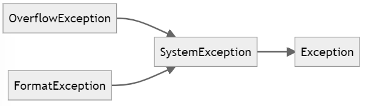

Therefore, we could use `Exception` to catch any types of exception since it is the *great-granddaddy* of all exceptions.

```c#
try
{
    
}
catch (Exception ex)
{
    //this block will handle all kinds of exception
}
```


:pushpin:**The order execute the `catch` block**

Taking the following as an example:

```c#
try
{
    //some code here
}
catch(FormatException fEx)
{
    
}
catch(OverflowException oEx)
{
    
}
```

If the code throw both `FormatException` and `OverflowException`, the program will only fall in **ONE** `catch` block which is the **first** catching block!!


:pushpin:**A great practice ordering the `Exception`**

With preceding demonstration, a general good practice is to handle the **specific exception in the head** and **general exception at the tail**.

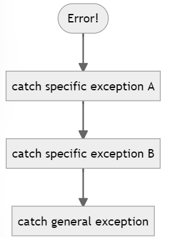

```c#
try
{
}
catch(FormatException fEx)
{
}
catch(OverflowException oEx)
{
}
catch(Exception ex)
{
}
```


:pushpin:**filtering exception**

Although the exception is catch, while you only want to process those errors you are interested. You can:

```c#
try
{
    
}
catch(Exception ex) when (errorType == 4)
{
    //it will handle errors only if the variable errorType == 4
}
```


:pushpin:**Propagating Exception**

The propagating exception is nothing else but decide when to handle the exception in which scope.

> ​	Propagating exception to outside

```C#
try
{
    ScopeA
    {
        ScopeB
        {
            //ERROR
        }
    }
}
catch
{
    //catch ERROR
}
```

> ​	catch right away, no propagation!

```c#
try
{
    ScopeA
    {
        try
        {
            ScopeB
            {
                //ERROR
            }
        }
        catch
        {
            //catch ERROR
        }
    }
}
catch
{
    
}
```


:page_facing_up: To conclude, you can either propagate exception or not. It depends on the nature of the app you are building.


#### 6.2. `checked` and `unchecked` for integer operation

:pushpin:**integer may overflow silently**

> ​	You CAN'T notice it is overflowed with `try-catch`

```c#
try
{
    int max = int.MaxValue;
    Console.WriteLine(max+1);
}
catch(Exception ex)
{
    
}
```

There is no errors in console but with `-2147483648` as result. That's because **C# allows the calculation to overflow silently**. 


:pushpin:**Why doesn't C# check overflow?**

Because!! Arithmetic operation are everywhere in the program and it is SO BAD for performance if checks every arithmetic operation.


:pushpin:**How should we catch `OverflowException`?**

There are **2** methods:

1.Turn on such flag to ask C# compiler to check. (NOT recommend:x:)

> ​	Right click the Project - Properties - Build - Advanced - [x]Check for arithmetic overflow 

2.Use `checked` and `unchecked` (recommend:heavy_check_mark:)

Use the `checked` and `unchecked` keywords to turn on and off integer arithmetic overflow checking in where you want to check.


:pushpin:**`checked` and `unchecked` statement**

```c#
int max = int.MaxValue;
unchecked
{
    Console.WriteLine($"Unchecked: {max + 1}");
}
checked
{
    Console.WriteLine($"Checked: {max + 1}");  //this will not be printed since it is overflow
}
```

The output:

```
Unchecked: -2147483648

Unhandled Exception: System.OverflowException: Arithmetic operation resulted in an overflow.
```


:pushpin:**`checked` and `unchecked` expression**

```c#
int maxUnchecked = unchecked(int.MaxValue+1);  //NO ERROR
int maxChecked = checked(int.MaxValue+1);      //ERROR!!!
```


:pushpin:**NOT support floating-point**

You cannot use the `checked` and `unchecked` keywords to control floating-point (noninteger) arithmetic. The `checked` and `unchecked` keywords apply only to integer arithmetic using data types such as `int` and `long`.


#### 6.3. `throw` exception

There are many `Exception` that can be throw. Just search and throw!

:pushpin:**`throw` statement**

```c#
if(day==1)
{
    
}
else if(day==3)
{
    
}
//..
else if(day==7)
{
    
}
else
{
    //day is in the domain of 1 to 7, now there is no options suitable
    throw new ArgumentOutOfRangeException("No such day!");
}
```


:pushpin:**`throw` expression** :star:

Suppose:

```c#
string name;
if(nameField.Text != "")
{
    name = nameField.Text;
}
else
{
    throw new Exception("No input!");
}
```

The objective of this statement is to **assign** value to this variable. Recommend to use ternary operator!

```c#
string name = nameField.Text != "" ? nameField.Text : throw new Exception("No Input!");
```

This is more elegant!!


#### 6.4. `finally` block

:pushpin:**What does it do?**

A `finally` block to **ensure** that critical **code always runs**, **even if an exception occurs**.


:pushpin:**Example - Dispose file** :star:

This is very handy dealing with accessing a file. Because you have to make sure `Dispose` statement always executes at the end even if an exception occurs. Otherwise the file is occupied.

```c#
TextReader reader = ...; 
//...
try 
{
    string line = reader.ReadLine(); 
    while (line != null) 
    {
        //...
        line = reader.ReadLine();
    }
} 
finally
{
    if (reader != null)
    {
        reader.Dispose();   //Dispose the file in the end no matter what
    }
}
```


# 7.Class and objects

**Overview:dart:**:

- `public`, `protected`, `private` to control the accessibility of members
- Create objects by using the `new` keyword to invoke a constructor
- Write constructor
- Create method and data can be shared among all instances of a class by `static`
- Create anonymous class


## 7.1.Class and classification

:pushpin:**What is Class?**

Class is the root word of the term classification. When you design a class, you <u>**systematically arrange information and behavior**</u> into a meaningful entity.


:pushpin:**What is an entity?**

Entity can be expressed in the following ways:

- represent a **<u>specific</u>** item such as a customer
- represent something <u>**abstract**</u>, such as a transaction


## 7.2. Encapsulation

:pushpin:**What is Encapsulation?**

Encapsulation is an <u>**important**</u> principle <u>when defining classes</u>. 


:pushpin:**Key Idea of Encapsulation**

The idea is that a program that uses a class should not have to account for how that class actually works internally; the program simply creates an instance of a class and calls the methods of that class.

e.g. You use `Console.WriteLine` as it is. And you don't care how it implements inside.

```c#
Consolw.WriteLine("Hello World!");
```


:pushpin:**Objective of Encapsulation**

- **Combine** data and methods within a class.   (how to **<u>define</u>** a class)
- **Control** the accessibility of the data and methods.  (how to <u>**use**</u> a class)


## 7.3. Define and Use a Class

:pushpin:**What is the difference between class and object?**

class - the <u>definition</u> of a type, e.g. the cookie cutter

object - an <u>instance</u> of that type, e.g. the cookie


:pushpin:**What is "field"?**

You can see "field" as a global variable inside a class which can be read/write by methods of this class.


:pushpin:**Example to define and use**

You can define a class like this:

```c#
class Circle
{
    //field
    int radius;
    
    //constructor - how you define "cookie cutter"
    public Circle(int r)
    {
        this.radius = r;
    }
    
    //method
    double ComputeArea()
    {
        return Math.PI * radius * radius;
    }
}
```

You can use it like this:

```c#
Circle c = new Circle(10);
int area = c.ComputeArea();
```


## 7.4. Control Accessibility


:pushpin:****


:pushpin:****


:pushpin:****


:pushpin:****


:pushpin:****


:pushpin:****


:pushpin:****


:pushpin:****


:pushpin:****


:pushpin:****


:pushpin:****


:pushpin:****


:pushpin:****


:pushpin:****


:pushpin:****


:pushpin:****


:pushpin:****


:pushpin:****


:pushpin:****


:pushpin:****


:pushpin:****


:pushpin:****


:pushpin:****


:pushpin:****


:pushpin:****


:pushpin:****


:pushpin:****


:pushpin:****


:pushpin:****


:pushpin:****


:pushpin:****


:pushpin:****


:pushpin:****


:pushpin:****


:pushpin:****


:pushpin:****


:pushpin:****


:pushpin:****


:pushpin:****


:pushpin:****


:pushpin:****


:pushpin:****


:pushpin:****


# 14.Garbage collection and resource management

**Overview:dart:**:

- Manage system resources by using **<u>garbage collection</u>**. 
- Write code that runs when an object is destroyed.
- Use `try`/`finally` statement to release a resource in an <u>exception-safe</u>[^2] manner.
- Use `using` statement to release a resource in an <u>exception-safe</u> manner. 
- Implement the `IDisposable` interface to support <u>exception-safe</u> disposal in a class.

[^2]: exception-safe means 发生异常时安全


## 14.1. The lifetime of an object

:pushpin:**What is garbage collection?**

Like object creation, object destruction is a **<u>two-phase</u>** process. The phases of destruction mirror the phases of creation:
1. The **<u>common language runtime (CLR)</u>** perform tidying up by a destructor you write.
2. The **<u>CLR deallocate the memory</u>** of the object and return the memory back to the heap.

The process of destroying an object and returning memory to the heap is known as **<u>garbage collection</u>**.

|        | Object Creation       | Object Destruction                           |
| ------ | --------------------- | -------------------------------------------- |
| Step 1 | define in Constructor | define in Destructor                         |
| Step 2 | use `new` keyword     | in C++, they use `delete`. but in C# use CLR |


### 14.1.1. Writing destructor

:pushpin:**When should you use destructor?**

The CLR will automatically clear up any managed resources that an object uses, so **in many of these cases, writing a destructor is unnecessary**. Therefore you could use destructor in the following circumstances:

- a managed resource is <u>large</u> (such as a multidimensional array)
- an object references an <u>directly/indirectly unmanaged resource</u>  (such as file streams, network connections, database connections)


:pushpin:**Syntax of destructor**

`~`

```c#
class FileProcessor
{
	FileStream file = null;
    public FileProcessor(string fileName)
    {
        this.file = File.OpenRead(fileName); // open file for reading
    }
    ~FileProcessor()
    {
        this.file.Close(); // close file
    }
}
```

Note: this is simply an example, and don't follow preceding pattern for opening and closing files.:warning:


:pushpin:**Constraint of destructor**

:one:Destructors apply only to reference types. You can't apply to value type like `struct`.

:x:

```c#
struct MyStruct
{
	~MyStruct() { ... } // compile-time ERROR!!
}
```

:two:No access modifier for a destructor.

:x:

```c#
public ~FileProcessor() 
{
	... // compile-time ERROR!!
} 
```

Because only CLR can access destructor and therefore you can specify the access modifier.

:three:No parameters for destructor.

:x:

```c#
~FileProcessor(int num) 
{
	... // compile-time ERROR!!
} 
```

It still due to the fact that only CLR can access destructor.


### 14.1.2. Why use the garbage collector?

:pushpin:**Tell me why?**

In short, **<u>managing object lifetimes is complex</u>**, and therefore the designers of C# decided to prevent your code from taking on this responsibility.


:pushpin:**Difference between C# and C++**

|                                  | C#               | C++                |
| -------------------------------- | ---------------- | ------------------ |
| Access to manage object lifetime | :x:              | :heavy_check_mark: |
| Robustness & Security            | :arrow_up_small: | :arrow_down_small: |


:pushpin:**What Garbage Collector promise?**

Few things it promises:

:one:  **<u>Every object will be destroyed</u>**, and its destructor will be run. When a program ends, all outstanding objects will be destroyed. 

:two:  **<u>Every object will be destroyed exactly once</u>**. 

:three:  <u>**Every object will be destroyed only when it becomes unreachable**</u>—that is, when there are **no references to the object** in the process running your application.


:pushpin:**What is a GREAT practice using Garbage Collector?**

$\because$ Garbage collection is an **<u>expensive process</u>**.

$\therefore$ Performing **a few large sweeps of memory** is more efficient than performing lots of little dustings.


### 14.1.3. How does Garbage Collector work?

This topic is out of the scope of this book. Please refer to the following link:

[Fundamentals of garbage collection by Microsoft](https://docs.microsoft.com/en-us/dotnet/standard/garbage-collection/fundamentals)

[My note for CLR][clrViaCs]


### 14.1.4. Tips for using Garbage Collector

:one: Try to **AVOID using destructors** except when you really need them—use them only to reclaim unmanaged resources.

:two:  Be very **careful** when you write a destructor.

:three:  Ensure that destructors **do not depend on one another**.


## 14.2. Resource management

:thinking:**Context**:

> ​	The context for resource management is that **some resources have to be released** *as soon as possible*.

:envelope:**Example**:

> ​	Memory
>
> ​	Database Connection
>
> ​	File Handles

🎯**Strategy**:

> ​	Release the resource yourself.

:hammer:**Tools**:

> ​	Create a **disposal**[^1] method—a method that <u>**explicitly disposes of a resource**</u>. If a class has a disposal method, you can call it and control when the resource is released.


### 14.2.1. Disposal Method

:pushpin:**Example Code**

```c#
TextReader reader = new StreamReader(filename);
string line;
while ((line = reader.ReadLine()) != null)
{
	Console.WriteLine(line);
}
reader.Close();  //Here! Dispose/Close!!
```

The main purpose of the preceding code is to **read a text file line by line** and **close it in the end**. 


:pushpin:**Serious Problem!**:warning:

It’s **not safe from exceptions**. If the call to the block`{}` throws an exception, the call to `Close()` **will not happen**; it will be bypassed. It may **<u>run out of file handles</u>** and be **<u>unable to open any more files</u>**.:x:


### 14.2.2. Exception-safe disposal

To **ensure** that a disposal method (such as `Close()`) is **always called**, you can use `try-finally` block.

```c#
TextReader reader = new StreamReader(filename);
try
{
	string line;
    while ((line = reader.ReadLine()) != null)
    {
		Console.WriteLine(line);
    }
}
finally
{
	reader.Close();  //no matter how, it will close the file.
}
```


:pushpin:**Constraint of `try-finally` logic**

:one:  Can't handle multiple resources.  e.g. If **1** `try-finally` block refers to **1** file. Multiple resources means nested `try-finally` blocks!

:x:

```c#
A-Resources;
try
{
    //operation on A-Resources
    BResources
    try
    {
        //operation on B-Resources
    }
    finally
    {
        //release the B-Resources
    }
}
finally
{
    //release the A-Resources
}
```

:two:  Fail to create an abstraction of the solution. Because this mechanism is hard-code and therefore it is hard to reproduce.

:three:  Possibly use the resource after it has been released.  Because the variable is declared out of the `try-finally` block.

:x:

```c#
TextReader someReader = new StreamReader(filename)
try
{
    //operation
}
finally
{
    //release the someReader
}

//!!You may reuse the someReader here!!
```


### 14.2.3. `using` statement and `IDisposable` interface:star:

:pushpin:**Different meanings of `using`**:rotating_light:

`using` in this section refers to `using ` **statement**.

`using` **directive** is the one which brings a namespace into scope.


:pushpin:**Why `using` is good?**

:one:  It provides **a clean mechanism** for controlling the lifetimes of resources.

:two:  Object **only exists inside** the `using` statement block and it will be destroyed out of the block.


:pushpin:**Example**

Pseudo code:

```c#
using ( type variable = initialization )
{
	StatementBlock
}
```

Code:

```c#
//variable declared in using will be destroyed once left the block
using (TextReader reader = new StreamReader(filename))
{
	string line;
    while ((line = reader.ReadLine()) != null)
    {
		Console.WriteLine(line); 
    } 
}
```


:pushpin:**Prerequisite of `using`**

The variable inside `using` statement **MUST** be of a type that **implements** the `IDisposable` interface. The `IDisposable` interface contains just one method, `Dispose()`.

```c#
namespace System
{
	interface IDisposable
    {
        void Dispose(); 
    }
}
```

The purpose of the `Dispose()` method is to **free** any **resources used by an object**.


:pushpin:**Benefits of `using` statement**

:one:Scalability when disposing multiple resources. 

:two:Compatible with the program code. 

:three:Abstracts away the problem and avoids repetition. 

:four:**ROBUST**:star:


### 14.2.4. `Dispose()` in a destructor:star::star::star:

:pushpin:**What is the context writing `Dispose()` in destructor?**

When you are writing your own class, there are 2 options to manage resources:

- :one: Write the **destructor** by your own.
- :two: Implement `IDisposable` interface, so that you can take `using` to manage your instances.

Therefore, the best practice is do **both**.


:pushpin:**Great practice of implementing `Dispose()`**

The following is the best practice of implementing `IDisposable` and `Dispose()`.

```c#
class Example : IDisposable
{
    private Resource scarce;
    //The variable is to prevent disposing of the resources multiple times
    //if it is called concurrently
    private bool disposed = false;
    
    ~Example()
    {
        //`false` means only the unmanaged resources will be released.
        //why don't release the managed resources?
        //Because they will be, or might already have been, handled by the garbage collector,
        this.Dispose(false);
    }
    
    public virtual void Dispose()
    {
        //`true` means both managed and unmanaged resources will be release.
        this.Dispose(true);
        
        //This method stops the garbage collector from
        //calling the destructor on this object because
        //the object has already been finalized.
        GC.SuppressFinalize(this);
    }
    
    protected virtual void Dispose(bool disposing)
    {
        if(!this.disposed)
        {
            if(disposing)
            {
                //release large, managed resource here
            	//..
            }
            //release unmanaged resources here
        	//..
            this.disposed = true;
        }
    }
    
    public void SomeBehavior()  //example method
    {
        this.checkIfDisposed();
        //...
    }
    
    private void checkIfDisposed()
    {
        if(this.disposed)
        {
            throw new ObjectDisposedException("Example: object has been disposed");
        }
    }
}
```


There are **2** `Dispose` method with different signature. The difference can be elaborated in the following:

> ​	:one:

```c#
public virtual void Dispose();
```

> ​	:two:

```c#
protected virtual void Dispose(bool disposing);
```

**Comparison**::star:


|                   | `public virtual void Dispose()`             | `protected virtual void Dispose(bool disposing)`             |
| ----------------- | ------------------------------------------- | ------------------------------------------------------------ |
| Access            | can be called at any time                   | cannot be called at any time, only inside class or derived class |
| Use               | it <u>just call</u> the `protected` version | it <u>actually performs</u> the resource disposal            |
| Called by `using` | This is used in `using` statement directly  | This not directly used in `using` statement                  |


The overload version of `protected virtual void Dispose(bool disposing)` has **2** options:

- `disposing == true`
  - release <u>large, managed resource</u>:heavy_check_mark: and <u>unmanaged resource</u>:heavy_check_mark:
  - used by `public` version
- `disposing == false`
  - don't release <u>large, managed resource</u>:x: and but release <u>unmanaged resource</u>:heavy_check_mark:
  - used by destructor, only called by the garbage collector when your object is being finalized


:pushpin:****


:pushpin:****


# 20.Delegate and Event

**Overview:dart:**:

- Declare a `delegate` type to create an <u>abstraction of a method signature</u>.
- Create an instance of a delegate to refer to a specific method.
- Call a method through a delegate.
- Define a lambda expression to specify the code to be executed by a delegate.
- Declare an `event` field.
- Handle an `event` by using a `delegate`.
- **Raise** an <u>event</u>.


:pushpin:**Why delegate?**

You need to <u>avoid introducing dependencies</u> that might restrict the use of your class. **Delegates** provide the ideal solution, which fully **decouple**[^3] the <u>application logic in your methods</u> from the <u>applications that invoke them</u>.


## 20.1. Understanding delegates

:pushpin:**Definition of `delegate`**

A `delegate` is a **<u>reference</u>** to a method.


:pushpin:**A smell of `delegate`**

(what the following method does or how the Processor class is defined is immaterial for this discussion, please focus on the idea of `delegate`)

```c#
class Program
{
    //Declare a delegate 
    public delegate void AnimalSound(int num);

    static void Main(string[] args)
    {
        //Init the delegate
        AnimalSound sound;

        //dog -> point the delegate to Dog's sound
        sound = Dog.DogSound;
        sound(3);

        //cat -> point the delegate to Cat's sound
        sound = Cat.CatSound;
        sound(2);
    }
}

class Cat
{
    //the function must match the SIGNATURE of delegate
    public static void CatSound(int num)
    {
        for (int i = 0; i < num; i++)
        {
            Console.WriteLine("mew...");
        }
    }
}
class Dog
{
    //the function must match the SIGNATURE of delegate
    public static void DogSound(int num)
    {
        for (int i = 0; i < num; i++)
        {
            Console.WriteLine("woof...");
        }
    }
}
```


Few things to be noticed:

- :one:  **No parentheses and parameters after the method name**, even if the method has. This is just an **<u>assignment</u>** statement.

- :two:  A `delegate` is **similar** to a <u>function pointer</u> in C++. The difference is that `delegate` is **type-safe**!! a.k.a. 
  - You can make a `delegate` refer ONLY to a method that **<u>matches</u>** **the signature of the `delegate`**
  - You CANNOT invoke[^4] a `delegate` that does not refer to a valid method.  (analogy in variable, you cannot use a variable without value)


## 20.2. Example of using `delegate`

:pushpin:**`delegate` in the .NET Framework class library**

We will introduce **2** delegates type, which are:

- `Func<T, ...>`  , this will be covered in this section.
- `Action<T, ...>`  , this will only be mentioned a little bit.


> ​	`Func<T, ..>`

You are actually using it everyday! The parameter taken by the `Average`, `Max`, `Count`, and other methods of the `List<T>` class **<u>is actually a generic</u>** `Func<T, TResult>` delegate:star:.  You may wonder 'What the heck?!':thinking:  Here is a code example:

```c#
struct Person
{
    public int ID { get; set; }
    public string Name { get; set; }
    public int Age { get; set; }
} 
//...
List<Person> personnel = new List<Person>()
{
    new Person() { ID = 1, Name = "John", Age = 53 },
    new Person() { ID = 2, Name = "Sid", Age = 28 },
    new Person() { ID = 3, Name = "Fred", Age = 34 },
    new Person() { ID = 4, Name = "Paul", Age = 22 }
};
```

You want to get the amount of people around 30-39.

```c#
int thirties = personnel.Count(p => p.Age >= 30 && p.Age <= 39);
```

- `T` in `Func<T, TResult>` is <u>the type of data</u> in the list  (in this case, the `Person` struct)

- `TResult` in `Func<T, TResult>` is <u>determined by the context</u> in which the delegate is used.  (in this case, the `int`)

Therefore, the type of the **<u>delegate</u>** expected by the `Count` method is `Func<Person, int>`.


> ​	`Action<T, ..>`

An `Action` delegate is used to **<u>reference a method that performs an action</u>** instead of returning a value (a `void` method).


**Conclusion**: You **<u>can't</u>** actually see `delegate` in `Count` or `Func<T, ...>` or `Action<T, ...>`. It rather <u>implements the `delegate` behind the scenes</u>. 


:pushpin:**`delegate` in the automated factory scenario **

Suppose you have **3** machines, and each machine has its own way to **shut down**.

- Folding Machine
  - Stop Folding
- Welding Machine
  - Finish Welding
- Painting Machine
  - Paint Off

Now you want to have a Controller to control all the **`Shut Down()`** button in case of any dangers.:warning:


> :x:	The old and <u>**outdated**</u> way to do is:

```c#
//Shut down method in Folding Machine
public class FoldingMachine
{
    public void StopFolding() => Console.WriteLine("Folding Machine stop folding...");
}
//Shut down method in Welding Machine
public class WeldingMachine
{
    public void FinishWelding() => Console.WriteLine("Welding Machine finished welding...");
}
//Shut down method in Painting Machine
public class PaintingMachine
{
    public void PaintOff() => Console.WriteLine("Painting Machine off...");
}

//Explicitly includes the shut down function one by one
public class Controller
{
    private FoldingMachine foldingMachine = new FoldingMachine();
    private WeldingMachine weldingMachine = new WeldingMachine();
    private PaintingMachine paintingMachine = new PaintingMachine();

    public void ShutDown()
    {
        foldingMachine.StopFolding();
        weldingMachine.FinishWelding();
        paintingMachine.PaintOff();
    }
}
```

Call the shut down:

```c#
static void Main(string[] args)
{
    Controller controller = new Controller();
    controller.ShutDown();
}
```

Result:

```
Folding Machine stop folding...
Welding Machine finished welding...
Painting Machine off...
```


> :no_mouth:	<u>**Stupid way**</u>: adds the machine methods to the `delegate` in the Controller constructor

(The stop method in each machine remains the same.)

```c#
public class Controller
{
    //declare the delegate
    delegate void StopMachineDelegate();
    //instance of delegate as the field
    private StopMachineDelegate stopMachineDelegate;
	
    //instances of each machine
    private FoldingMachine foldingMachine = new FoldingMachine();
    private WeldingMachine weldingMachine = new WeldingMachine();
    private PaintingMachine paintingMachine = new PaintingMachine();

    public Controller()
    {
        //add stop method to this delegate
        this.stopMachineDelegate += foldingMachine.StopFolding;
        this.stopMachineDelegate += weldingMachine.FinishWelding;
        this.stopMachineDelegate += paintingMachine.PaintOff;
    }

    //the shut down method includes all the stop methods
    public void ShutDown()
    {
        this.stopMachineDelegate();
    }
}
```

Run it:

```c#
static void Main(string[] args)
{
    Controller controller = new Controller();
    controller.ShutDown();
}
```


> :heavy_check_mark:	Add `delegate` outside of the class

(The stop method in each machine remains the same.)

```c#
public class Controller
{
    //make the delegate as public
    public delegate void StopMachineDelegate();
    public StopMachineDelegate stopMachineDelegate;

    public void ShutDown()
    {
        this.stopMachineDelegate();  //run it
    }
}
```

Run it:

```c#
static void Main(string[] args)
{
    //Init the machines
    FoldingMachine foldingMachine = new FoldingMachine();
    WeldingMachine weldingMachine = new WeldingMachine();
    PaintingMachine paintingMachine = new PaintingMachine();
    //Init the controller
    Controller controller = new Controller();

    //Add stop methods to delegate
    controller.stopMachineDelegate += foldingMachine.StopFolding;
    controller.stopMachineDelegate += weldingMachine.FinishWelding;
    controller.stopMachineDelegate += paintingMachine.PaintOff;

    //run
    controller.ShutDown();
}
```


> :heavy_check_mark:	Create a **read/write property** to provide access to a `private` delegate

(The stop method in each machine remains the same.)

```c#
public class Controller
{
    //public delegate, private delegate instance
    public delegate void StopMachineDelegate();
    private StopMachineDelegate stopMachineDelegate;

    //public property handling StopMachine delegate
    public StopMachineDelegate StopMachine
    {
        get => this.stopMachineDelegate;
        set => this.stopMachineDelegate = value;
    }
    
    public void ShutDown()
    {
        this.stopMachineDelegate();
    }
}
```

Run it:

```c#
//Init the machines
FoldingMachine foldingMachine = new FoldingMachine();
WeldingMachine weldingMachine = new WeldingMachine();
PaintingMachine paintingMachine = new PaintingMachine();
//Init the controller
Controller controller = new Controller();

//Add stop methods to Property
controller.StopMachine += foldingMachine.StopFolding;
controller.StopMachine += weldingMachine.FinishWelding;
controller.StopMachine += paintingMachine.PaintOff;

//run
controller.ShutDown();
```


> :heavy_check_mark:	Provide complete **<u>encapsulation</u>** by implementing separate `Add` and `Remove` methods

(The stop method in each machine remains the same.)

```c#
public class Controller
{
    public delegate void StopMachineDelegate();
    private StopMachineDelegate stopMachineDelegate;

    public void ShutDown()
    {
        this.stopMachineDelegate();
    }
    
	//Add stop method to delegate instance
    public void AddStopMethod(StopMachineDelegate machineDelegate)
    {
        this.stopMachineDelegate += machineDelegate;
    }
    
	//Remove stop method to delegate instance
    public void RemoveStopMethod(StopMachineDelegate machineDelegate)
    {
        this.stopMachineDelegate -= machineDelegate;
    }
}
```

Run it:

```c#
static void Main(string[] args)
{
    //Init the machines
    FoldingMachine foldingMachine = new FoldingMachine();
    WeldingMachine weldingMachine = new WeldingMachine();
    PaintingMachine paintingMachine = new PaintingMachine();
    //Init the controller
    Controller controller = new Controller();

    //Add stop methods to delegate
    controller.AddStopMethod(foldingMachine.StopFolding);
    controller.AddStopMethod(weldingMachine.FinishWelding);
    controller.AddStopMethod (paintingMachine.PaintOff);

    //run
    controller.ShutDown();
}
```


:pushpin:**`delegate`in UWP**

Suppose you have the following business logic, you start checking out, then trigger shipping and auditing[^5] at the same time.


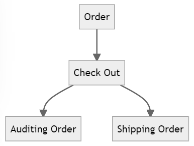


Suppose in the **`MainPage.xaml`**,  you have a button

```xaml
<Button x:Name="checkout" Grid.Row="4" IsEnabled="False" Content="Checkout" HorizontalAlignment="Center" VerticalAlignment="Center" Click="CheckoutButtonClicked" />
```


When you click the button, it triggers `CheckoutButtonClicked`, so you have the following function in **`MainPage.xaml.cs`**:

```c#
private void CheckoutButtonClicked(object sender, RoutedEventArgs e)
{
    try
    {
        // Perform the checkout processing
        this.auditor.AuditOrder(this.order);  //Watch HERE:  Auditing!!
        this.shipper.ShipOrder(this.order);   //Watch HERE:  Shipping!!
        
        //...
    }
    catch (Exception ex)
    {
        MessageDialog dlg = new MessageDialog(ex.Message, "Exception");
        dlg.ShowAsync();
    }
}
```


Apparently, there should be a function do auditing and shipping a<u>t the same time</u>. Meanwhile, the parameter of `ShipOrder(Order order)` is same as the parameter of `AuditOrder(Order order)`.


$\because$ the motions happen after checking out, $\therefore$ we can make a class called `CheckoutController`

```c#
public class CheckoutController
{
    //declare a delegate combining all the check out methods
    public delegate void CheckoutDelegate(Order order);
    //init the delegate as field
    public CheckoutDelegate CheckoutProcessing = null;

    public void StartCheckoutProcessing(Order order)
    {
        //Wrap the delegate method field inside a function
        if (this.CheckoutProcessing != null)
        {
            this.CheckoutProcessing(order);
        }
    }
}
```

Attention!:star::warning:[^6]

After setting up the structure above, we can implement the `MainPage.xaml.cs`.

```c#
public MainPage()
{
    this.InitializeComponent();

    this.auditor = new Auditor();
    this.shipper = new Shipper();
    this.checkoutController = new CheckoutController();
    
    //add the methods into the public delegate field
    this.checkoutController.CheckoutProcessing += auditor.AuditOrder;
    this.checkoutController.CheckoutProcessing += shipper.ShipOrder;
}
```

Therefore, the `CheckoutButtonClicked` could be:

```c#
private void CheckoutButtonClicked(object sender, RoutedEventArgs e)
{
    try
    {
        // Perform the checkout processing with ONE delegate method!!
        this.checkoutController.StartCheckoutProcessing(this.order);

        //...
    }
    catch (Exception ex)
    {
        MessageDialog dlg = new MessageDialog(ex.Message, "Exception");
        dlg.ShowAsync();
    }
}
```


## 20.3. Lambda expressions and delegates:star:

Here comes an important question:

> ​	what if you want to `delegate` a method with <u>different signature</u>?:star:

```c#
//the delegate method takes no parameters
delegate void StopMachineDelegate();
public StopMachineDelegate stopMachineDelegate;

//What if some method changed its signature?
public void StopFolding(int num);
public void FinishWelding(double degree);
public void PaintOff();
```

There are **2** solutions:

- adapter
- lambda `delegate`:star:


:pushpin:**Adapter**

One solution is to use [Adapter](https://github.com/XingxinHE/SoftwareDevelopment/tree/main/2_DesignPattern/DesignPatterns#41-adapter) which you simply wrap the method into a version with same signature.

```c#
void FinishFolding()
{
    //...
    this.StopFolding(0);
}
```

And then you add the wrapped version:

```c#
this.stopMachineDelegate += folder.FinishFolding;
```


:pushpin:**Lambda `delegate`**:star:

This is super convenient! You just do like this:

```c#
this.stopMachineDelegate += ( () => folder.StopFolding(10) );
```

How is it?! This is incredible! Taking the sensor package I develop, the connect method are supper different.

```c#
//connect method of wenglor sensor
public void WenglorConnect(string ip, string port, int timeout);

//connect method of tcp client
public void TcpConnect(string ipAndPort);
```


## 20.4. Notification by `event`

:pushpin:**Why `event`?**

Although `delegate` is super powerful, it still has to be called explicitly. Therefore, `event` is designed to be called automatically in certain condition. 

The .NET Framework provides `event`, which you can use to <u>define and trap significant actions</u> and <u>arrange for a `delegate` to be called to handle the situation</u>.


### 20.4.1. Basic of `event`

:pushpin:**The structure of `event` related stuffs**

- **event source**.  The `event` variable is declared inside a class intended to act as an event source. An <u>event source</u> is usually a class that <u>monitors its environment</u> and <u>raises an `event` when something significant happens</u>.
- **subscribers**.  An `event` <u>maintains a list of methods to call</u> when it is raised. These methods are sometimes referred to as *subscribers*.


Analogy in the preceding machine example:

- **event source** - `class TemperatureMonitor` which monitors the temperature of each machine.
- **subscribers** - response to “machine overheating” `event` and take all the `ShutDown()` methods of different machines.


:pushpin:**The general process using `event`**

- :one:  declare an `event`
- :two:  subscribe to that `event`  /  unsubscribe to that `event`
- :three:  Raise an `event`


> ​	declare `event`:

```c#
event delegateTypeName eventName;
```

`delegateTypeName` refers to the type of `delegate`. In short, you first have a `delegate`, then you have an `event` based on that `delegate`.

`eventName` is the name of such event, like a name of a variable.

```c#
class TemperatureMonitor
{
    //declare delegate
    public delegate void StopMachineryDelegate();
    //declare event
    public event StopMachineryDelegate MachineOverheadting;
}
```


> ​	subscribe and unsubscribe to `event`:

subscribe `+=`

```c#
TemperatureMonitor tempMonitor = new TemperatureMonitor();
//...
tempMonitor.MachineOverheating += (  () => {folder.StopFolding(10);} );
tempMonitor.MachineOverheating += welder.FinishWelding;
tempMonitor.MachineOverheating += painter.PaintOff;
```

unsubscribe `-=`

```c#
tempMonitor.MachineOverheating -= (  () => {folder.StopFolding(10);} );
tempMonitor.MachineOverheating -= welder.FinishWelding;
tempMonitor.MachineOverheating -= painter.PaintOff;
```


> ​	raise an `event`:

<u>Raise an `event`</u> is the same as <u>calling a method</u>. When you raise an `event`, all the attached delegates are called in sequence.

```c#
class TemperatureMonitor
{
	public delegate void StopMachineryDelegate();
	public event StopMachineryDelegate MachineOverheating;
	//...
    private void Notify()
    {
        //it is essential to if the event is null
        if (this.MachineOverheating != null)
        {
        	this.MachineOverheating();
        }
    }
    //...
}
```


:pushpin:**Important Note of `event`**

Events have a very useful built-in security feature. A **<u>`public`</u>** `event` (such as `MachineOverheating`) can be <u>**raised only by methods in the class**</u> that define it (the `TemperatureMonitor` `class`). Any attempt to raise the event outside the class results in a compiler error.


### 20.4.2. Case Study of `event`

Continuing the practice in `delegate` of `CheckoutService`. The process is the following:

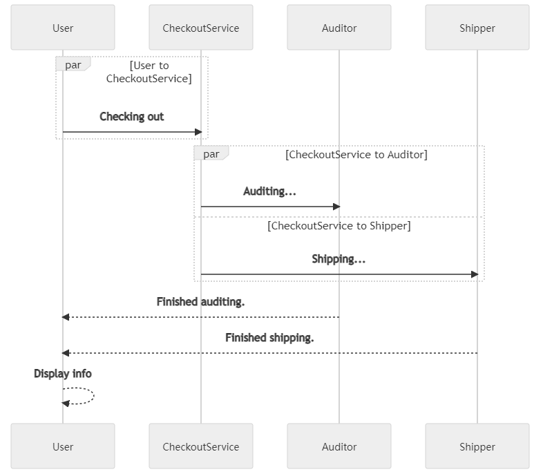


Therefore, the design can be documented as:

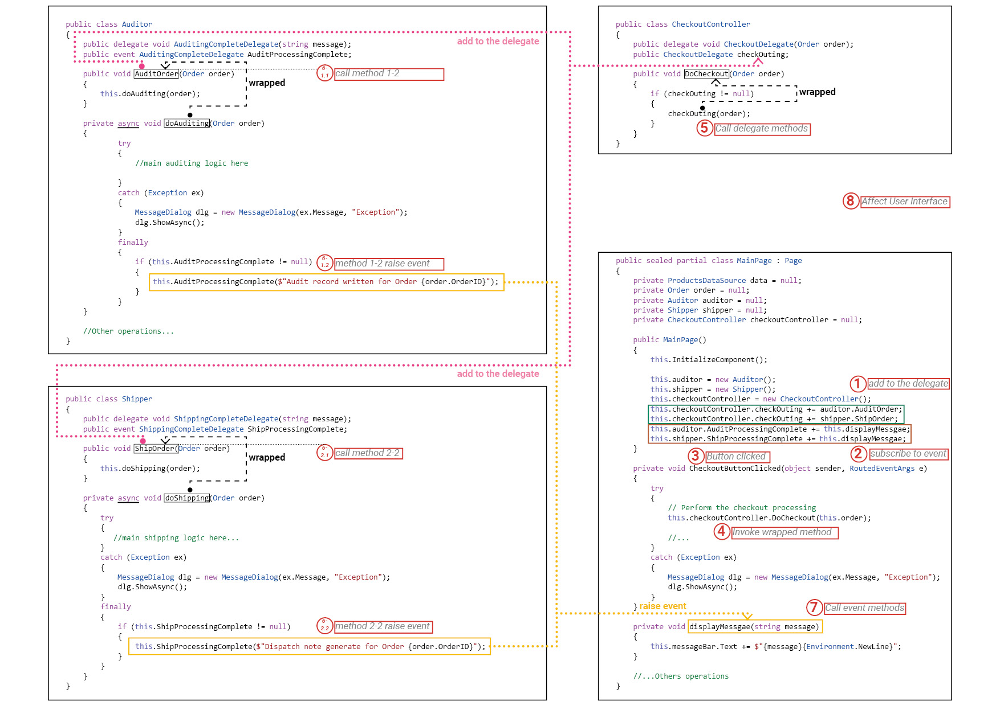


## 20.5. `Action<T>` and `Func<T,TResult>` - supplement material

https://docs.microsoft.com/en-us/dotnet/api/system.action-1?view=net-6.0

https://docs.microsoft.com/en-us/dotnet/api/system.func-2?view=net-6.0

:pushpin:**What is `Action<T>` exactly?**

<u>Encapsulates a method</u> that has <u>a single parameter</u> and <u>does not return a value</u>.


:pushpin:**Detail behind `Action<T>`**

The code behind `Action<T>` is the following:

```c#
public delegate void Action<in T>(T obj);
```

- `T` 

`T` is the type of the parameter of the method that this delegate encapsulates.

- `obj`

`obj` is the parameter of the method that this delegate encapsulates.

- $\empty$

Since `Action<T>` has no return.


:pushpin:**Example of `Action<T>` delegate**

//TODO


# 23.Concurrency by `Task` and `Parallel`

🎯**Overview**

- Use the `Task` class to **<u>create and run parallel operations</u>** in an application
- Use the `Parallel` class to <u>**parallelize**</u> some common programming **constructs**.
- <u>Cancel</u> long-running <u>tasks</u> and <u>handle exceptions</u> raised by parallel operations.


:pushpin:**Why perform multitasking by using parallel processing?**

There are **2** primary reasons why you might want to perform <u>**multitasking**</u> in an application:

- To improve responsiveness

- To improve scalability


:pushpin:**What should C# developer do?**

To make the best use of multicore processors, you need to write your applications to <u>**take advantage of multitasking**</u>.[^7]


## 23.1. Implementing multitasking in .NET

:pushpin:**Definition**

Multitasking is the ability to do more than one thing at the same time.


:pushpin:**What should be considered to implement multitasking?**

- **:star:  [My Job]**  How to <u>**divide an application into a set of concurrent operations**</u>? 
- [C# 's Job]  How to arrange for a set of operations to execute concurrently, on multiple processors? 
- [C# 's Job]  How to perform only as many concurrent operations as there are processors available? 
- [C# 's Job]   If an operation is blocked (such as while waiting for I/O to complete), how to detect this and arrange for the processor to run a different operation rather than sit idle[^8]? 
- [C# 's Job]   How to determine when concurrent operations have completed?

For programmer, only the first job needs to be considered. Others have been already implemented in `System.Threading.Tasks`.


:pushpin:**Disclaimer!!**

The point about <u>**application design is fundamental**</u>. If an <u>application is not designed with multitasking</u> in mind, then it <u>doesn’t matter how many processor cores you throw at it</u>, it will not run any faster than it would on a single-core machine.


### 23.1.1. `Task`, `Thread`, and `ThreadPool` Overview

:pushpin:**What is `Task`?**

`Task` is a class which is <u>**an abstraction of a concurrent operation**</u>. 

:pushpin:**How to use `Task`?**

Create a `Task` object to run a block of code. You can instantiate multiple `Task` objects and start them running in parallel if sufficient processors or processor cores are available. 

:pushpin:**Relationship between `Task` and processor**

 numbers of `Task` object $\neq$ number of processor

a.k.a. You can create `Task` more than processor.


:pushpin:**Why not `Thread`?**

Because `Thread` is <u>**outdated**</u>!!  The program use the number of `Thread` you explicitly create, and the operating system will schedule <u>**only that number of threads**</u>. This may lead to: 

- :one:  :x:overloading and poor response time  **when**  $n$ of `Thread` $\gt\gt$ $n$ of processors
- :two:  :x:efficiency and poor throughput  **when**  $n$ of `Thread` $\gt\gt$ $n$ of processors


:pushpin:**What is `ThreadPool`?**

It was developed in C# 4.0 which is to enhance `Task`.


:pushpin:**What is `WinRT`?**

It is called Window Runtime, WinRT. It can take `Thread` and `ThreadPool` to optimize to better support `Task`.


:pushpin:**Conclusion**:star:

- [You] <u>divide or partition the code into tasks that can be run in parallel</u>. 

- [WinRT] create the appropriate number of threads based on the processor architecture and workload of your computer, associating your tasks with these threads and arranging for them to be run efficiently.


### 23.1.2. Create, Run, and Control `Task`

:pushpin: **Create `Task`**

There are many ways to create `Task`, please refer to the [doc](https://docs.microsoft.com/en-us/dotnet/api/system.threading.tasks.task?view=net-6.0).


> ​	:one:  Initializes a new `Task` with <u>the specified action</u> and <u>state</u>.

```c#
Task(Action<Object>, Object)
```

`Action<Object>`, The delegate that represents the code to execute in the task.

`Object`, An object representing data to be used by the action.


Then the code would be:

```c#
private void doWorkWithObject(object 0)
{
    //some code here...
}

Action<object> action;
action = doWorkWithObject;
object parameterData = ...;
Task task = new Task(action, parameterData);
//...
```


> ​	:two: Initializes a new `Task` with the specified action.

```c#
Task (Action action);
```

`Action`, The delegate that represents the code to execute in the task.


Then the code would be:

```c#
private void doWork()
{
    //some code here...
}
Task task = new Task(doWork);
//...
```


:pushpin:**Run `Task`**

Once the `Task` is created, you can run it like:

```c#
Task task = new Task(...);
task.Start();
```

The `.Start()` method has several overload version, and you can specify [flags](https://docs.microsoft.com/en-us/dotnet/api/system.threading.tasks.taskcreationoptions?view=net-6.0) that control optional behavior for the creation and execution of tasks.


:pushpin:**Create and Run `Task` in 1 step**

Since *create* and *run* are very common, you can use `Task.Run()` to combine both operations!

```c#
Task task = Task.Run( () => doWork() );
```


:pushpin:**Continue a `Task` after a finished `Task`**

```c#
//you have 2 methods want to operate
private void doWork()
{
    //...
}

private void doMoreWork(Task task)//pay attention to the parameter here!!!
{
    //...
}

Task task = new Task(doWork);
task.Start();
Task newTask = task.ContinueWith(doMoreWork);
//...
```

A few texts on explaining the `doMoreWork()` method: <u>**why**</u> does it take **<u>a `Task` instance for an input</u>**?:thinking:

The scheduler passes into the method <u>**a reference to the task**</u> that completed. The value returned by `ContinueWith` is a reference to the new `Task` object. Therefore the connection between 2 紧紧相连的 tasks can be extracted by this way. See the example:

```c#
Task < string > t = Task.Run(() = > LongRunningOperation("Continuewith", 500));  
t.ContinueWith(
    (t1) = >   
               {  
                   if (t1.IsCompleted && !t1.IsFaulted && !t1.IsCanceled) UpdateUI(t1.Result);  
               }
			   );
```


:pushpin:**Proper Example of `ContinueWith()`**

//TODO 加上我做钢结构焊接产品的代码，工艺的

the following example is quite trivial.:star:

```c#
var task = Task.Run(
    () =>
    {
        DateTime date = DateTime.Now;
        //return Result of this task
        return date.Hour > 17
            ? "evening"
            : date.Hour > 12
                ? "afternoon"
                : "morning";
    });

await task.ContinueWith(
    
    //this is the alias of last task
    antecedent =>
    
    {
        //use the result from last task
        Console.WriteLine($"Good {antecedent.Result}!");
        Console.WriteLine($"And how are you this fine {antecedent.Result}?");
    }, 
    //specify the continue option
    TaskContinuationOptions.OnlyOnRanToCompletion);
```


:pushpin:**Options for `ContinueWith()`**

There are [options](https://docs.microsoft.com/en-us/dotnet/api/system.threading.tasks.taskcontinuationoptions?view=net-6.0) as `enum` for `ContinueWith`. There **3** pairs can be memorized together.


`NotOnCanceled`

> ​	the continuation should <u>run only if</u> the <u>previous action **completes**</u> and **<u>is not canceled</u>**

`OnlyOnCanceled`

> ​	the continuation should <u>run only if</u> the <u>previous action</u> is <u>**canceled**</u>


`NotOnFaulted`

> ​	the continuation should <u>run only if</u> the <u>previous action</u> <u>**completes**</u> and <u>**does not throw an unhandled exception**</u>

`OnlyOnFaulted`

> ​	the continuation should <u>run only if</u> the <u>previous action</u> **<u>throws an unhandled exception</u>**


`NotOnRanToCompletion`

> ​	the continuation should <u>run only if</u> the <u>previous action</u> **<u>does not complete[^9] successfully</u>**

`OnlyOnRanToCompletion`

> ​	the continuation should <u>run only if</u> the <u>previous action</u> **<u>completes successfully</u>**


The example could be like:

```c#
Task task = new Task(doWork);
task.ContinueWith(doMoreWork, TaskContinuationOptions.NotOnFaulted);
task.Start();
```


:pushpin:**Control `Task` by `Wait()`**

The fundamental <u>reason</u> to **control** a `Task` is that <u>**synchronizing tasks**</u> is <u>a common requirement</u> of applications that invoke operations in parallel. **`Wait()`** is one of the methods to <u>suspend execution of the current thread until the specified task completes.</u>

```c#
Task task = ...
task.Start();
//...
task.Wait();  //Wait here until task is finished
```

You can also use `static` method to wait for a set of tasks.

```c#
Task.WaitAll(task1, task2);  //Wait task1 AND task2 complete
Task.WaitAny(task1, task2);  //Wait task1 OR task2 complete
```


## 23.2. Case Study of `Task`

:pushpin:**How to find CPU bottleneck?**

Performance Explorer in Visual Studio(pro-version).


:pushpin:**Code Analysis**

There is a button for generating an image on the UWP.

<div align="center">
    <figure>
        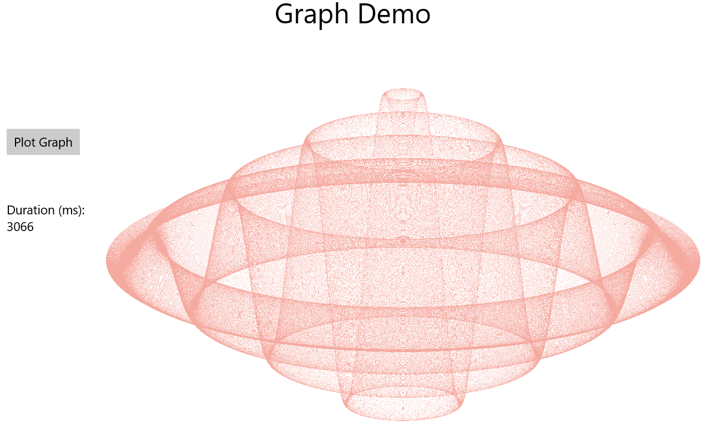
        <figcaption>Performance required optimization, 3066ms</figcaption>
    </figure>
</div>

The code looks like:

```c#
private void plotButton_Click(object sender, RoutedEventArgs e)
{
    //prepare data etc...
    
    //Here is the real function for visualization
    generateGraphData(data);
    
    //visualize the data to the window...
}
```

Inside this button click, the essential method for generating graph data is:

```c#
private void generateGraphData(byte[] data)
{
    double a = pixelWidth / 2;
    double b = a * a;
    double c = pixelHeight / 2;
    for (double x = 0; x < a; x++)
    {
        double s = x * x;
        double p = Math.Sqrt(b - s);
        for (double i = -p; i < p; i += 3)
        {
            double r = Math.Sqrt(s + i * i) / a;
            double q = (r - 1) * Math.Sin(24 * r);
            double y = i / 3 + (q * c);
            plotXY(data, (int)(-x + (pixelWidth / 2)), (int)(y + (pixelHeight / 2)));
            plotXY(data, (int)(x + (pixelWidth / 2)), (int)(y + (pixelHeight / 2)));
        }
    }
}
```

We can see that **both 2 loops** <u>compute separately</u>.

Hence, this method is the one we need to optimize into multi-threading method.


:pushpin:**Optimization method 1 - Use `Task`**

:one:  Modify the method for multitasking

```c#
//function before computes all at once
private void generateGraphData(byte[] data);

//function after modified
private void generateGraphData(byte[] data, int partitionStart, int partitionEnd)
{
    //...

    for (int x = partitionStart; x < partitionEnd; x++)
    {
        //...
    }
```

:two:  Use `Task` to execute in multitasking

```c#
//before, compute at once
generateGraphData(data);

//(1-2)after, split the computation into 2
Task first = Task.Run(() => generateGraphData(data, 0, pixelWidth / 4));
Task second = Task.Run(() => generateGraphData(data, pixelWidth / 4, pixelWidth / 2));
Task.WaitAll(first, second);

//(2-2)after, split the computation into 4

```

<div align="center">
    <figure>
        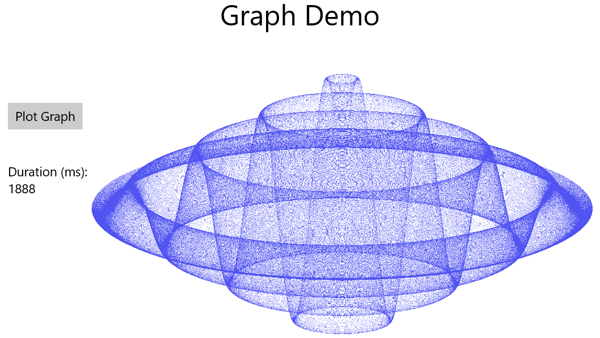
        <figcaption>Performance - split into 2 tasks, 1888ms</figcaption>
    </figure>
    <figure>
        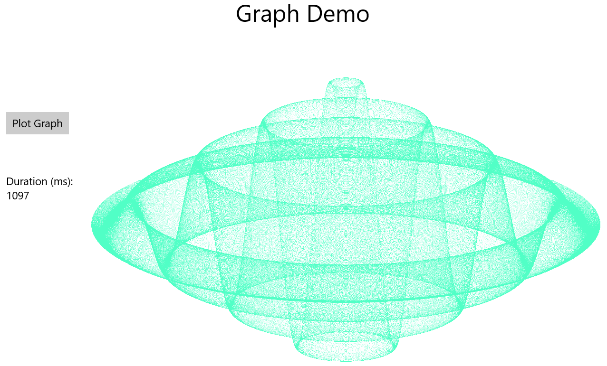
        <figcaption>Performance - split into 4 tasks, 1097ms</figcaption>
    </figure>
</div>


## 23.3. Use `Parallel` to abstract tasks

:pushpin:**Benefit to use `Parallel`**

Compared to `Task`, using `Parallel` does not require to redesign an application to accommodate the use of `Task` objects.


:pushpin:**How does `Parallel` work?**

- the `Parallel` class creates its own set of `Task` objects
- it synchronizes these tasks automatically when they have completed.


:pushpin:**`static` method in `Parallel`**

> ​	`Parallel.For`

It is a method similar to simple `for`.There are various overload versions while its fundamental mechanism is very much the same. It demands **3** inputs:

- start value
- end value
- a reference to a method

```c#
private static void performLoopProcessing(int num)
{
    Console.WriteLine($"Print {num}...");
}
static void Main()
{
    Parallel.For(0, 100, performLoopProcessing);
}
```


> ​	`Parallel.ForEach<T>`

`T` must fulfill `IEnumerable<T>` before using `Parallel.ForEach<T>`

//TODO add `Parallel.ForEach<T>` code example


> ​	`Parallel.Invoke`

```c#
private static void countTen()
{
    for (int i = 0; i < 10; i++)
    {
        Console.WriteLine($"Current: {i}...");
    }
}

private static void countTenBackward()
{
    for (int i = 10; i > 0; i--)
    {
        Console.WriteLine($"Count: {i}...");
    }
}

private static void printName()
{
    List<string> names = new List<string> {
        "Paul", "John", "Debby", "Andrea", "Maria",
        "Eason", "Vincent", "Lucy"};
    foreach(string name in names)
    {
        Console.WriteLine(name); ;
    }
}

static void Main()
{
    Parallel.Invoke(
        countTen,
        countTenBackward,
        printName
    );
}
```


:pushpin:**Notes before using `Parallel`**:warning::star:

- If you are not running CPU-bound code[^10], parallelizing it <u>might not improve performance</u> since operations like creating a task, running task on a separate thread would be greater than the cost of running this method directly.
- Only use `Parallel.Invoke` for <u>**computationally intensive operations**</u>
- the parallel operations should be <u>**independent**</u>


## 23.4. Cancel `Task` and handle `Exception`

:pushpin:**Why and when should we cancel a `Task`?**

A <u>common requirement</u> of applications that <u>perform long-running operations</u> is the ability to stop those operations if necessary.


:pushpin:**How to cancel?**

Not brutally cancel it but use a <u>cooperative cancellation</u>[^11] strategy instead.


### 23.4.1. Mechanics of cooperative cancellation

:pushpin:**How does it work?**

Cooperative cancellation is based on a **<u>cancellation token</u>** which is a structure representing a request to cancel one or more tasks.


:pushpin:**Tip for using cancellation token**

Should check for cancellation at least every `10 ms`, but no more frequently than every millisecond.


:pushpin:**Status of a `Task`**

There are **6** status of a `Task`.

| Status            | Description                                                  |
| ----------------- | ------------------------------------------------------------ |
| `Created`         | `Task` is created but has <u>not yet been scheduled</u> to run |
| `WaitingToRun`    | `Task` has been <u>scheduled</u> but has <u>not yet started to run</u> |
| `Running`         | `Task` is currently <u>being executed</u> by a thread        |
| `RanToCompletion` | `Task` <u>completed successfully</u> without any unhandled exceptions |
| `Canceled`        | `Task` <br />:one:was canceled before it could start running<br />:two:acknowledged cancellation and completed without throwing an exception |
| `Faulted`         | `Task` is terminated because of an exception.                |


### 23.4.2. Simple Cancel `Task`

:pushpin:**Workflow for cancellation token**

- :one:create a `System.Threading.CancellationTokenSource` object
- :two:query the `Token` property of this object
- :three:pass `CancellationToken` *object* as a parameter to methods started by tasks
- :four:if required cancel, calls the `Cancel` method of the `CancellationTokenSource` object
- :five:sets the `IsCancellationRequested` property of the `CancellationToken` passed to all the tasks

Intuitively, you can see that the `Token` is a employee and the `TokenSource` is its boss. Once the boss call `Cancel`, the employee will receive the `Cancel` from his/her phone. Then the employee cancels the method.


:pushpin:**Example using cancellation**

The following is a screenshot while you cancel the plotting.

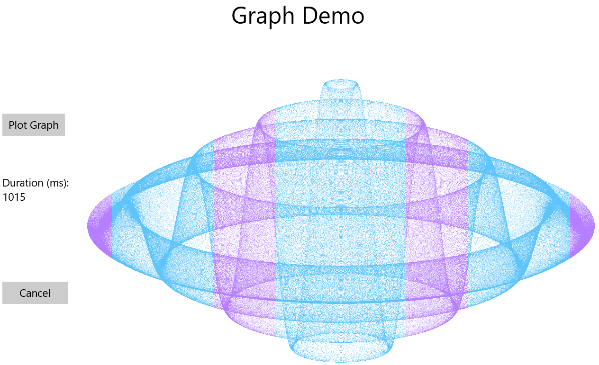


```c#
public sealed partial class MainPage : Page
{
    // ...
    
    //Token source as global field!
    private CancellationTokenSource tokenSource = null;

    public MainPage()
    {
        //...
        this.InitializeComponent();
    }

    // Generate the data for the graph and display it in ASYNC mode
    private async void plotButton_Click(object sender, RoutedEventArgs e)
    {
		//...
        
        //everytime click this button, init a new token source
        this.tokenSource = new CancellationTokenSource();
        //query the token
        CancellationToken token = this.tokenSource.Token;

        // Generate the data for the graph
        Task first = Task.Run(() => generateGraphData(data, 0, pixelWidth / 4, token));
        Task second = Task.Run(() => generateGraphData(data, pixelWidth / 4, pixelWidth / 2, token));

        await first;
        await second;
        
        //...
    }

    // Stop graph generation and display
    private void cancelButton_Click(object sender, RoutedEventArgs e)
    {
        if (this.tokenSource != null)
        {
            //once the cancel button click, the token source raise a cancel
            tokenSource.Cancel();
        }
    }

    // Complex function that generates the data for the graph
    private void generateGraphData(byte[] data, int partitionStart, int partitionEnd, CancellationToken token)
    {
        int a = pixelWidth / 2;
        int b = a * a;
        int c = pixelHeight / 2;

        for (int x = partitionStart; x < partitionEnd; x++)
        {
            //the token will raise the cancell
            if (token.IsCancellationRequested)
            {
                return;
            }
            //...
            plotXY(...);
            plotXY(...);
        }
    }

    // Store the data for a given point in the graph in the array
    private void plotXY(byte[] data, int x, int y)
    {
        //...
    }
}
```


### 23.4.3. Proper Cancel `Task`

The proper way to cancel the `Task` should place the `token` as a parameter in `Task` as well. The code should look like this:

```c#
public sealed partial class MainPage : Page
{
    // ...
    
    private CancellationTokenSource tokenSource = null;

    public MainPage()
    {
        //...
        this.InitializeComponent();
    }

    private async void plotButton_Click(object sender, RoutedEventArgs e)
    {
		//...
        
        this.tokenSource = new CancellationTokenSource();
        CancellationToken token = this.tokenSource.Token;

        // add the token inside the Task!!
        Task first = Task.Run(() => generateGraphData(data, 0, pixelWidth / 4, token), token);
        Task second = Task.Run(() => generateGraphData(data, pixelWidth / 4, pixelWidth / 2, token), token);

        //  use try-catch block to handle cancel exception
        try
        {
            await first;
        	await second;
        }
        catch(OperationCanceledException oce)
        {
            duration.Text = oce.Message;
        }
        
        
        //...
    }

    private void cancelButton_Click(object sender, RoutedEventArgs e)
    {
        if (this.tokenSource != null)
        {
            tokenSource.Cancel();
        }
    }

    private void generateGraphData(byte[] data, int partitionStart, int partitionEnd, CancellationToken token)
    {
        int a = pixelWidth / 2;
        int b = a * a;
        int c = pixelHeight / 2;

        for (int x = partitionStart; x < partitionEnd; x++)
        {
            //Proper way cancel
            token.ThrowIfCancellationRequested();
            //if (token.IsCancellationRequested)
            //{
                //return;
            //}
            //...
            plotXY(...);
            plotXY(...);
        }
    }

    private void plotXY(byte[] data, int x, int y)
    {
        //...
    }
}
```


### 23.4.4. Cancel `Parallel.For` and `Parallel.ForEach<T>`

//TODO


An Example using `Parallel.For` with `Rhino.Geometry`:

```c#
/// <summary>
/// Orient points from Sensor space to Rhino space
/// </summary>
/// <param name="scanPoints">points in sensor space</param>
/// <param name="ToolTCP">the tcp of tool, e.g. sensor</param>
/// <param name="FlangeTCP">the tcp of flange</param>
/// <returns>true for success, false for failed</returns>
public static bool ScanPointsToRhino(List<Point3d> scanPoints, Plane ToolTCP, Plane FlangeTCP)
{
    try
    {
        int step = scanPoints.Count;
        Transform xFormToolToFlange = Transform.PlaneToPlane(Plane.WorldXY, ToolTCP);
        Transform xFormFlangeToRhino = Transform.PlaneToPlane(Plane.WorldXY, FlangeTCP);
		//index is the index for parallel looping
        Parallel.For(0, step, index =>
                     {
                         Point3d pt = scanPoints[index];
                         pt.Transform(xFormToolToFlange);
                         pt.Transform(xFormFlangeToRhino);
                         scanPoints[index] = pt;
                     });
    }
    catch (Exception)
    {
        return false;
    }
    return true;
}
```


### 23.4.5. Handle `AggregateException`

<u>Exception handling</u> is an <u>**important**</u> element in any commercial application. In complex application, the `Task` regularly has to wait for multiple tasks to complete. Therefore, there will be `AggregateException` in one place.

The following is an example to show how to handle exception

```c#
// first you need to have a function to handle aggregate exception
private bool handleException(Exception e)
{
    if (e is DivideByZeroException)
    {
        displayErrorMessage("Division by zero occurred");
        return true;
    }
    if (e is Index)
}
```


## 23.5. Continuations with canceled and faulted `Task`

You can continue a task under a specific status.

```c#
Task task = new Task(doWork);
task.ContinueWith(doCancellationWork, TaskContinuationOptions.OnlyOnCanceled);
task.Start();
...
private void doWork()
{
    //..
}
private void doCancellationWork(Task task)
{
    //..if doWork is cancelled, the program will execute here...
}
```


# 24.Concurrency by `async`

:pushpin:**Asynchronicity and scalability**


## 24.1.Implement Asynchronous method

:pushpin:**What is Asynchronous method?**

An <u>*asynchronous*</u> method is one that <u>does not block the current thread</u> on which it starts to run.


:pushpin:**What happened after invoking an asynchronous method?**

Once invokes, the method will <u>return control to the calling environment</u> and to <u>perform its work on a separate thread</u>.


:pushpin:**What should you use?**

`await` and `async`


### 24.1.1. Problem:page_with_curl: & Solution:hammer:

<h4>The Problem</h4>

Suppose you have a method called `slowMethod` which is invoked by a UI event, e.g. left mouse click. Meanwhile, the <u>**methods have to do it one after another**</u>.

```c#
private void slowMethod()
{
    doFirstLongRunningOperation();
    doSecondLongRunningOperation();
    doThirdLongRunningOperation();
    message.Text = "Processing Completed";
}
private void doFirstLongRunningOperation()
{
	...
}
private void doSecondLongRunningOperation()
{
	...
}
private void doThirdLongRunningOperation()
{
	...
}

```

The preceding problem is that the <u>UI thread(main thread) will be frozen</u> until the 3rd method completed.


> ​	:one:Implement method with `Task`, :x:

```c#
private void slowMethod()
{
    Task task = new Task(doFirstLongRunningOperation);
    task.ContinueWith(doSecondLongRunningOperation);
    task.ContinueWith(doThirdLongRunningOperation);
    task.Start();
    message.Text = "Processing Completed"; // this method executes right after task.Start()
}
private void doFirstLongRunningOperation()
{
	...
}
private void doSecondLongRunningOperation(Task t)
{
	...
}
private void doThirdLongRunningOperation(Task t)
{
	...
}
```

The preceding problem is that the `message.Text` <u>will not wait for the `task` end:cry:</u>. It pops up the message right after the `task.Start();`.


> ​	:two:Implement with `Task` and `Wait`, :x:

```c#
private void slowMethod()
{
    Task task = new Task(doFirstLongRunningOperation);
    task.ContinueWith(doSecondLongRunningOperation);
    task.ContinueWith(doThirdLongRunningOperation);
    task.Start();
    task.Wait();  //Block again!!
    message.Text = "Processing Completed";
}
```

The preceding problem is that the thread still waits for the `task.Wait()` which is *meaningless*. The <u>UI thread will block the interface</u> again.


> ​	:three:Implement with `Task` and define continuation:x:

```c#
private void slowMethod()
{
    Task task = new Task(doFirstLongRunningOperation);
    task.ContinueWith(doSecondLongRunningOperation);
    task.ContinueWith(doThirdLongRunningOperation);
    task.ContinueWith((t) => message.Text = "Processing Complete");  //execute in another thread
    task.Start();
}
```

The preceding problem is "<u>The application called an interface that was marshaled for a different thread</u>".

What does it mean?:thinking:

In C#, **only the main thread(UI thread) has the right to modify UI**. Other threads don't have the right.


> ​	:four:Implement with `Task`, define continuation, and use `Dispatcher`.  :ok::no_mouth:

```c#
private void slowMethod()
{
    Task task = new Task(doFirstLongRunningOperation);
    task.ContinueWith(doSecondLongRunningOperation);
    task.ContinueWith(doThirdLongRunningOperation);
    task.ContinueWith((t) => this.Dispatcher.RunAsync(
    CoreDispatcherPriority.Normal,
    () => message.Text = "Processing Complete"));
    task.Start();
}
```

The `Dispatcher` object is **<u>a component of the user interface infrastructure</u>**, and you can send it requests to perform work on the user interface thread by calling its `RunAsync` method. Although this works, but it is messy and hard to maintain the code.


<h4>The Solution</h4>

The keywords `async` and `await` are to tackle such problem and you don't have to concern to use `Dispatcher`.


There are few things worth discussed.

> ​	:pushpin:what should be the operand of `await`?

The thing right next to `await` is called operand, e.g. `doFirstLongRunningOperation` is the operand of `await`. The **operand must be a `Task`**. A.k.a. The return type of the method is `Task`.


> ​	:pushpin:what is the mechanism behind?

It is very similar to using `Dispatcher`.

`async` :

​	does - :heavy_check_mark:  specify that the code in the method can be divided into one or more continuations.

​	does not - :x:  signify that a method runs asynchronously on a separate thread

`await`:

​	does - :heavy_check_mark:  specifies when the C# compiler can <u>split the code into a continuation</u>. The right hand side of `await` is an awaitable
object is a type that provides the `GetAwaiter` method.


> ​	:hammer:**Solution 1**

```c#
private async void slowMethod()
{
    await doFirstLongRunningOperation();
    await doSecondLongRunningOperation();
    await doThirdLongRunningOperation();
    message.Text = "Processing Complete";
}
//the method returns a Task!
private Task doFirstLongRunningOperation()
{
    Task t = Task.Run(() => { /* original code goes here */ });
    return t;
}
private Task doSecondLongRunningOperation()
{
    Task t = Task.Run(() => { /* original code goes here */ });
    return t;
}
private Task doThirdLongRunningOperation()
{
    Task t = Task.Run(() => { /* original code goes here */ });
    return t;
}
```


> ​	:hammer:**Solution 2**

The preceding solution has **1** constraint. What if I want to split one long running operation into few parallelable task?

```c#
private Task doFirstLongRunningOperation()
{
    Task task1 = Task.Run(() => { /* Task 1 code goes here */ });
    Task task2 = Task.Run(() => { /* Task 2 code goes here */ });
    
    return ...;  //which task should I return?
}
```

The solution is to make the method `async` as well.

```c#
private async Task doFirstLongRunningOperation()
{
    Task task1 = Task.Run(() => { /* Task 1 code goes here */ });
    Task task2 = Task.Run(() => { /* Task 2 code goes here */ });
    
    await task1;
    await task2;
}
```

In the main code should look like this:

```c#
private async void slowMethod()
{
    await doFirstLongRunningOperation();
    await doSecondLongRunningOperation();
    await doThirdLongRunningOperation();
    message.Text = "Processing Complete";
}
//the method returns a Task!
private async Task doFirstLongRunningOperation()
{
    Task task1 = Task.Run(() => { /* Task 1 code goes here */ });
    Task task2 = Task.Run(() => { /* Task 2 code goes here */ });
    
    await task1;
    await task2;
}
private async Task doSecondLongRunningOperation()
{
    Task task1 = Task.Run(() => { /* Task 1 code goes here */ });
    Task task2 = Task.Run(() => { /* Task 2 code goes here */ });
    
    await task1;
    await task2;
}
private async Task doThirdLongRunningOperation()
{
    Task task1 = Task.Run(() => { /* Task 1 code goes here */ });
    Task task2 = Task.Run(() => { /* Task 2 code goes here */ });
    
    await task1;
    await task2;
}
```


### 24.1.2. `async` methods return values

This refers to `Task<TResult>.Result`

Suppose you have a Task:

```c#
Task<int> calculateValueTask = Task.Run(() => calculateValue(...));

private int calculateValue(...)
{
    int someValue;
    // Perform calculation and populate someValue
    ...
    return someValue;
}
```

There are **2** ways you can run this method and get its value:

> ​	**Solution 1:hammer:**         Will block until the task complete:x:

```c#
int calculateData = calculateValueTask.Result;
```


> ​	**Solution 2:hammer:**    :heavy_check_mark:

```c#
int calculateData = await calculateValueTask;
```


:pushpin:**What is the difference?**

Using `Result` would block until the task had completed. 

Using `await` does the opposite - it *unwraps* a `Task<T>` to a `T` value. It won't block the thread!


### 24.1.3. `async` method gotchas:warning::star:

:one: `async` does NOT 100% means method runs asynchronously :x:


:two: `async` does mean the method contains statements that <u>**may**</u> run asynchronously.


:three: `await` indicates a method should be run by a separate task. The calling code is suspended until the method call completes.

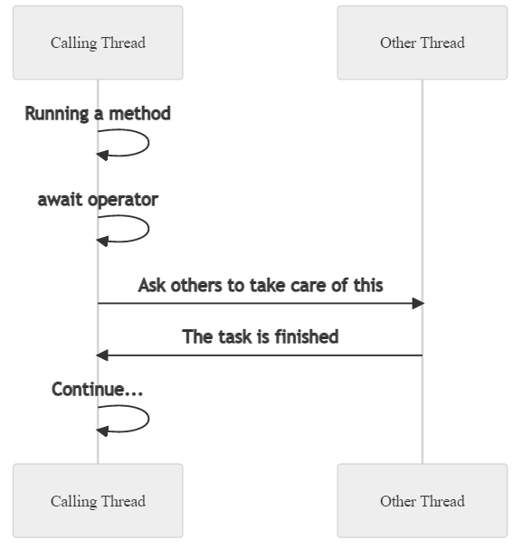


:four: `await` is NOT `Wait`!:warning: The former would not block, the latter would.


:five: By default, the code that resumes execution after an `await` operator attempts to obtain the **<u>original thread</u>**.

Use `ConfigureAwait(false)` to specify code can be <u>resumed on any available thread</u>.

`ConfigureAwait(true)` is default.

The following is a <u>**bad**</u> example:x::

```c#
//This method
private async void slowMethod()
{
    await doFirstLongRunningOperation().ConfigureAwait(false);  //call back at any other thread
    await doSecondLongRunningOperation().ConfigureAwait(false); //call back at any other thread
    await doThirdLongRunningOperation().ConfigureAwait(false);  //call back at any other thread
    
    //this step must run in Main Thread(UI Thread)
    message.Text = "Processing Complete";
}
```


:six:**Careless** use of asynchronous methods!!:warning:

```c#
//suppose you have an async task
private async Task<string> generateResult()
{
    string result;
    ...
    result = ...
    return result;
}
```

:x:Wrong:

```c#
//suppose you have a method related to UI operation
private async void myMethod()
{
    var data = generateResult();  //you didn't await here
    ...
    message.Text = $"result: {data.Result}";  //this will block the thread
}
```

:ok:

```c#
//suppose you have a method related to UI operation
private async void myMethod()
{
    var data = generateResult();  //you didn't await here
    ...
    message.Text = $"result: {await data}";  //this will block the thread
}
```

:heavy_check_mark:my preference

```c#
//suppose you have a method related to UI operation
private async void myMethod()
{
    var data = await generateResult();  //you didn't await here
    ...
    message.Text = $"result: {data}";  //this will block the thread
}
```


### 24.1.4. `async` methods and the `WinRT` APIs

The designer of Windows 8 and later versions wanted to ensure the application as responsive as possible. So they decided any operations might take over 50ms have to implement they `async` API.


There are several methods can be called asynchronously.

:pushpin:**Display Message**

Displays the message and waits for the user to click the Close button.

```c#
using Windows.UI.Popups;
...
MessageDialog dlg = new MessageDialog("Message to user");
await dlg.ShowAsync();  //wait for user to close
```

 

:pushpin:**Select File**

Display the files in the user’s Documents folder and wait while the user selects a single file from this list

```c#
using Windows.Storage;
using Windows.Storage.Pickers;
...
FileOpenPicker fp = new FileOpenPicker();
fp.SuggestedStartLocation = PickerLocationId.DocumentsLibrary;
fp.ViewMode = PickerViewMode.List;
fp.FileTypeFilter.Add("*");
StorageFile file = await fp.PickSingleFileAsync();  //wait for user browsing
```


:pushpin:**Open a File**

Open a file in an asynchronous way:

```c#
var fileStream = await file.OpenAsync(FileAccessMode.Read);
```

 

:pushpin:**Render Pixels on Screen**

The pixels can be seen as stream.

```c#
Stream pixelStream = graphBitmap.PixelBuffer.AsStream();
pixelStream.Seek(0, SeekOrigin.Begin);
pixelStream.Write(data, 0, data.Length);
...
await pixelStream.WriteAsync(data, 0, data.Length);
...
```


### 24.1.5. Memory allocation with `ValueTask`

:pushpin:**Some Resources on `ValueTask`**

[Value Task Doc](https://docs.microsoft.com/en-us/dotnet/api/system.threading.tasks.valuetask-1?view=net-6.0)

[.NET Blog Understanding the Whys, Whats, and Whens of ValueTask](https://devblogs.microsoft.com/dotnet/understanding-the-whys-whats-and-whens-of-valuetask/)


:pushpin:**Case Study**

Please have a look on the following method:

```c#
public async Task<int> FindValueAsync(string key)
{
    //1. attempt to find it locally
    bool foundLocally = GetCachedValue(key, out int result);
    if (foundLocally)
    	return result;
    //2. if not, then try to do a long operation searching
    result = await RetrieveValue(key); // possibly takes a long time
	//3. add it to local Cache for next time
    AddItemToLocalCache(key, result);
    return result;
}
```


> ​	:bulb:**Pattern: `Cache-Aside`**

The preceding method uses [`Cache-Aside` pattern](https://docs.microsoft.com/en-us/azure/architecture/patterns/cache-aside) which <u>**load data on demand into a cache from a data store**</u>. This can <u>improve performance</u> and also helps to maintain consistency between data held in the cache and data in the underlying data store.


> ​	:chart_with_upwards_trend:**Analysis on this Method**

In most cases, the work will be <u>performed synchronously</u> (it finds the data in cache). The data is an integer, but it is returned wrapped in a `Task<int>` object. Compared to directly return an `int`, the former requires much **more time and memory allocation**. 

| Return Type | Operation                                                    | Memory   |
| ----------- | ------------------------------------------------------------ | -------- |
| `Task<int>` | :one:Create obj<br>:two:Populate obj<br>:three:Retrieve the data | On Steap |
| `int`       | return directly                                              | On Stack |


> ​	:hammer:**Solution**

Use `ValueTask` which **marshals** the return value as a <u>value type on stack</u> rather than <u>reference type on heap</u>.

```c#
//change the return type to ValueTask<T>
public async ValueTask<int> FindValueAsync(string key)
{
    bool foundLocally = GetCachedValue(key, out int result);
    if (foundLocally)
    	return result;
    result = await RetrieveValue(key); // possibly takes a long time
    AddItemToLocalCache(key, result);
    return result;
}
```


:pushpin:**Conclusion**

Return `ValueTask` only if the vast majority of the calls to an `async` method are <u>**likely**</u> to be <u>performed synchronously</u>. a.k.a. Most of the time, the call will **return before the `await` operator**. Otherwise, too much `async` operation inside a `ValueTask` can decrease the efficiency.


## 24.2. PLINQ to parallelize declarative data access:star::star:

Use`.AsParallel()`! The following are examples to perform **PLINQ**.

###  24.2.1. Learn PLINQ by example

:pushpin:**Example 1**

The first example is to filter numbers which are over 100.

> ​	Suppose you have an array called `numbers`

```c#
int[] numbers = new int[NUM];
Random random = new Random(999);

for (int i = 0; i < NUM; i++)
{
    numbers[i] = random.Next(200);
}
```

> ​	You have a pseudo test method

In reality, the query methods always take time. Therefore, here we used `Thread.SpinWait()` to execute "no operation" instruction for a period of time.

```c#
public static bool TestIfTrue(bool expr)
{
    Thread.SpinWait(1000);
    return expr;
}
```

> ​	Normal LINQ - old school

```c#
//Create a LINQ query
var over100Query = from num in numbers
                   where TestIfTrue(num > 100)
                   select num;

//The query actually runs here(time consuming)
List<int> over100 = new List<int>(over100Query);
```

> ​	Normal LINQ - new school

```c#
//Declare and run in one sentence
List<int> over100 = numbers.Where(num => TestIfTrue(num > 100))
                           .Select(num => num)
                           .ToList();
```

> ​	PLINQ - old school:smile:

```c#
//Create a LINQ query with Parallel!!
var over100Query = from num in numbers.AsParallel()
                   where TestIfTrue(num > 100)
                   select num;

//The query actually runs here(parallel!!)
List<int> over100 = new List<int>(over100Query);
```

> ​	PLINQ - new school:smile:

```c#
List<int> over100 = numbers.AsParallel()
    .Where(num => TestIfTrue(num > 100))
    .Select(num => num)
    .ToList();
```


:pushpin:**Example 2**

The second example is to create <u>customer order info</u> with 2 different sources, :one:<u>customers</u> and :two:<u>orders</u>.

> ​	Customers

A piece of customer info can be split by `,`  into 6 parts which contain:

- Customer ID
- Customer's company
- Address
- City
- Country or region
- Postal code.

```c#
//A pseudo in memory data representing customers info
public class CustomersInMemory
{
    public static string[] Customers = 
    {
        "ALFKI,Alfreds Futterkiste,Obere Str. 57,Berlin,Germany,12209",
        "ANTON,Antonio Moreno Taquería,Mataderos  2312,México D.F.,Mexico,05023",
        "BERGS,Berglunds snabbköp,Berguvsvägen  8,Luleå,Sweden,S-958 22",
        "BLAUS,Blauer See Delikatessen,Forsterstr. 57,Mannheim,Germany,68306",
        ...
        "WHITC,White Clover Markets,305 - 14th Ave. S. Suite 3B,Seattle,USA,98128",
        "WILMK,Wilman Kala,Keskuskatu 45,Helsinki,Finland,21240",
        "WOLZA,Wolski  Zajazd,ul. Filtrowa 68,Warszawa,Poland,01-012"
    };
}
```

> ​	Order

A piece of order info can be split by `,`  into 2 parts which contain:

- Order ID
- Customer ID
- Date of the order

```c#
//A pseudo in memory data representing order info
public class OrdersInMemory
{
    public static string[] Orders = 
    {
        "10248,VINET,Jul  4 1996 12:00AM",                                    
        "10249,TOMSP,Jul  5 1996 12:00AM",                                    
        "10250,HANAR,Jul  8 1996 12:00AM", 
        "11074,SIMOB,May  6 1998 12:00AM",
        ...
        "11075,RICSU,May  6 1998 12:00AM",                                    
        "11076,BONAP,May  6 1998 12:00AM",                                    
        "11077,RATTC,May  6 1998 12:00AM"
    }
}
```

> ​	Customer Order Info

Now, we need to create a <u>Customer-Order Info</u> by pairing the <u>customer info</u> and <u>order info</u> with their related key.

```c#
//The new data structure looks something like this
public class CustomerOrderInfo
{
    public string CustomerID { get; set; }
    public string CompanyName { get; set; } 
    public int OrderID { get; set; }
    public DateTime OrderDate { get; set; }
}
```

> ​	LINQ - Old School

```c#
var customerOrderInfoQuery = from c in CustomersInMemory.Customers
                             join o in OrdersInMemory.Orders
                             on c.Split(',')[0] equals o.Split(',')[1]
                             select new CustomerOrderInfo
                            {
                                CustomerID = c.Split(',')[0],
                                CompanyName = c.Split(',')[1],
                                OrderID = Convert.ToInt32(o.Split(',')[0]),
                                OrderDate = Convert.ToDateTime(o.Split(',')[2],
                                            new CultureInfo("en-US"))
                            };
List<CustomerOrderInfo> customerOrderInfo = new List<CustomerOrderInfo>(customerOrderInfoQuery);
```

> ​	LINQ - New School

```c#
//declare and create the query in one sentence
var customerOrderInfo = CustomersInMemory.Customers.Join(
    OrdersInMemory.Orders,
    c => c.Split(',')[0],
    o => o.Split(',')[1],
    (c, o) => new CustomerOrderInfo
    {
        CustomerID = c.Split(',')[0],
        CompanyName = c.Split(',')[1],
        OrderID = Convert.ToInt32(o.Split(',')[0]),
        OrderDate = Convert.ToDateTime(o.Split(',')[2],
                                       new CultureInfo("en-US"))
    }
).ToList();
```

> ​	PLINQ - old school:smile:

```c#
var customerOrderInfoQuery = from c in CustomersInMemory.Customers.AsParallel()
                             join o in OrdersInMemory.Orders.AsParallel()
                             on c.Split(',')[0] equals o.Split(',')[1]
                             select new CustomerOrderInfo
                            {
                                CustomerID = c.Split(',')[0],
                                CompanyName = c.Split(',')[1],
                                OrderID = Convert.ToInt32(o.Split(',')[0]),
                                OrderDate = Convert.ToDateTime(o.Split(',')[2],
                                            new CultureInfo("en-US"))
                            };
List<CustomerOrderInfo> customerOrderInfo = new List<CustomerOrderInfo>(customerOrderInfoQuery);
```

> ​	PLINQ - new school:smile:

```c#
var customerOrderInfo = CustomersInMemory.Customers.AsParallel().Join(
    OrdersInMemory.Orders.AsParallel(),
    c => c.Split(',')[0],
    o => o.Split(',')[1],
    (c, o) => new CustomerOrderInfo
    {
        CustomerID = c.Split(',')[0],
        CompanyName = c.Split(',')[1],
        OrderID = Convert.ToInt32(o.Split(',')[0]),
        OrderDate = Convert.ToDateTime(o.Split(',')[2],
                                       new CultureInfo("en-US"))
    }
).ToList();
```


> ​	Some Thought:thinking:

[2022/01/26]I used to code in the new school style. But recently I think... the old school is quite straight forward and relevant to English...


### 24.2.2. Canceling a PLINQ query

Very easy. Just take `.WithCancellation()`

```c#
using CancellationTokenSource cts = new();
int[] results = null;
try
{
    results =
        (from num in source.AsParallel().WithCancellation(cts.Token)
         where num % 3 == 0
         orderby num descending
         select num).ToArray();
}
catch{}
```


## 24.3. Synchronizing concurrent access to data

:pushpin:**What is the risk during concurrent process?**

If not doing correct, concurrent process might <u>corrupt the data</u> during overlapping operation.


:pushpin:**Corrupt Data Example**

:x:

```c#
static void ParallelTest()
{
    int[] data = new int[NUMELEMENTS];
    int j = 0;  //variable j is outside of the Parallel.For scope
    Parallel.For(0, NUMELEMENTS, (i) =>
                 {
                    j = i;
                     doAdditionalProcessing();
                     data[i] = j;
                     doMoreAdditionalProcessing();
                 });
    for (int i = 0; i < NUMELEMENTS; i++)
    {
        Console.WriteLine($"Element {i} has value {data[i]}");
    }
}
```

The preceding method simply records the current loop index into a <u>shared variable</u> `j`, and store back the `j` value to current index of the array.

This is WRONG!!! **Try NOT to use shared variable in concurrent process!!!:warning:**


### 24.3.1. `lock` data

If you really need to use shared data in concurrent operation, then `lock`is one of the choice.

:pushpin:**What is `lock`?**

You can use `lock` keyword to guarantee exclusive access[^12] to resources.


:pushpin:**`lock` example**

```c#
//you can use any reference type as a lock
//in convention, just use object is enough
object myLockObject = new object();

//...

lock(myLockObject)
{
    // Code that requires exclusive access to a shared resource
    //..
}
```


:pushpin:**How does `lock` work?**

- :one: the `lock` statement attempts to obtain a mutual-exclusion lock
- :two: once the 1st entered item have the lock, other threads will be blocked outside of the lock and wait
- :three: 1st entered item finished the job and left... the lock is open for another item

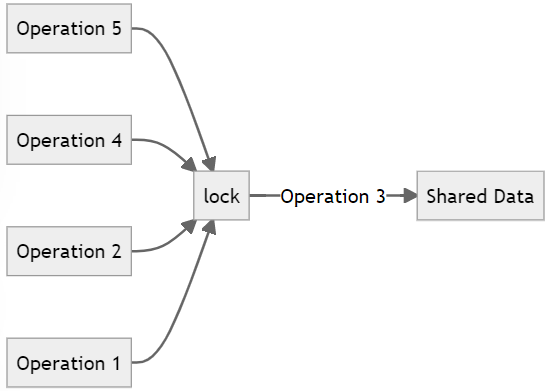


### 24.3.2. Synchronization primitives

Mutual exclusion lock is one of the locking techniques. In the following, we will introduce more techniques.

[Overview of synchronization primitives](https://docs.microsoft.com/en-us/dotnet/standard/threading/overview-of-synchronization-primitives?redirectedfrom=MSDN)

[Synchronizing data for multithreading](https://docs.microsoft.com/en-us/dotnet/standard/threading/synchronizing-data-for-multithreading)

:pushpin:**Different function of locking techniques**

- :one:a single task has **sole access** to a resource, (<u>simple exclusion lock</u>)
- :two:multiple tasks **access a resource simultaneously** with controlled manner, (<u>semaphores</u>)
- :three:share **read-only access to a resource simultaneously** while guaranteeing **exclusive access to modify the resource**, (<u>reader/writer locks</u>)

| Locking Techniques    | Sole Access Read   | Sole Access Write  | Simultaneous Access Read       | Simultaneous Access Write      |
| --------------------- | ------------------ | ------------------ | ------------------------------ | ------------------------------ |
| simple exclusion lock | :heavy_check_mark: | :heavy_check_mark: | :x:                            | :x:                            |
| semaphores            | :x:                | :x:                | :heavy_check_mark:(controlled) | :heavy_check_mark:(controlled) |
| reader/writer locks   | :x:                | :heavy_check_mark: | :heavy_check_mark:             | :x:                            |


:pushpin:**`ManualResetEventSlim` Class**:star:

> ​	Fun Fact

`ManualResetEventSlim` is the light weight version of `ManualResetEvent` and that's why call it "Slim".

> ​	Function

`ManualResetEventSlim` provides functionality by which <u>one or more tasks can wait for an event</u>.

> ​	How to use it?

An object of `ManualResetEventSlim` can be 1 of 2 states: **signaled** (true) and **unsignaled** (false). 

You can use **`Set()`** to change `unsignaled` to `signal`.

You can use **`Reset()`** to change `signaled` to `unsignaled`.

It is super similar to PLC connection!!:star:

> ​	Example

```c#
class Example
{
    //instance of ManualResetEventSlim
    static ManualResetEventSlim mreGotSignal;
    //input from user
    static string input = null;

    //create a method started by thred 2
    public static void GetUserInput()
    {
        Console.WriteLine("Waiting user's input...");
        input = Console.ReadLine();
        mreGotSignal?.Set();  //if got input, set the flag true
        Console.WriteLine($"Received user's input and the flag of mreGotSignal is {mreGotSignal.IsSet}");
    }

    static void Main()
    {
        //init the mre instance to be false at first
        mreGotSignal = new ManualResetEventSlim(false);
        while (true)
        {
            Console.WriteLine("Start listening input...");

            //running thread 2
            Task.Run(GetUserInput);

            Console.WriteLine("Main thread waiting mreGotSignal...");
            mreGotSignal?.Wait();  //wait here for the signal from thread 2

            Console.WriteLine($"Main thread signaled, received data: {input}");
            Console.WriteLine("Rest flag for next round...");
            mreGotSignal?.Reset();
        }
    }
}
```


:pushpin:**`SemaphoreSlim` Class**

> ​	Function

Represents a lightweight alternative to [Semaphore](https://docs.microsoft.com/en-us/dotnet/api/system.threading.semaphore?view=net-6.0) that <u>**limits the number of threads**</u> that can <u>access a resource</u> or pool of resources concurrently.

> ​	How to use it?

Init `Semaphore` with the number of resources in the pool.  `public SemaphoreSlim(int initialCount, int maxCount)`

- when access the resource, invoke the `Wait()`, the gate reduce
- when quit accessing, invoke `Release()`, the gate increase

> ​	Example

```c#
class Example
{
    private static SemaphoreSlim semaphore;
    private static int padding;

    static void Main()
    {
        //Create the semaphore
        //It means the max gates is 3, but right now the gate is 0
        semaphore = new SemaphoreSlim(0, 3);
        Console.WriteLine("{0} tasks can enter the semaphore.",
                            semaphore.CurrentCount);
        Task[] tasks = new Task[5];

        //Create and start 5 numbered tasks
        for (int i = 0; i < 5; i++)
        {
            tasks[i] = Task.Run(() =>
            {
                //Each task begins by requesting the semaphore
                Console.WriteLine("Task {0} begins and waits for the semaphore.",
                                Task.CurrentId);
                int semaphoreCount;
                
                semaphore.Wait();
                //the code below will wait to start until semaphore is signaled
                
                try
                {
                    Interlocked.Add(ref padding, 100);
                    Console.WriteLine("Task {0} enters the semaphore.", Task.CurrentId);

                    //The task sleeps for 1+ sec
                    Thread.Sleep(1000 + padding);
                }
                finally
                {
                    semaphoreCount = semaphore.Release();
                }
                Console.WriteLine("Task {0} releases the semaphore; previous count: {1}.",
                                Task.CurrentId, semaphore.CurrentCount);
            });
        }

        // Wait for half a second, to allow all the tasks to start and block.
        Thread.Sleep(500);

        // (Open the gate) set the semaphore count to its maximum value.
        Console.Write("Main thread calls Release(3) --> ");
        semaphore.Release(3);
        Console.WriteLine("{0} tasks can enter the semaphore.",
                            semaphore.CurrentCount);


        // Main thread waits for the tasks to complete.
        Task.WaitAll(tasks);

        Console.WriteLine("Main thread exits.");
    }
}
```


:pushpin:**`CountdownEvent` Class**

> ​	Function

Represents a synchronization primitive that is signaled when its count reaches zero. You can think of the `CountdownEvent` class as a cross between **<u>the inverse</u>** of  `SemaphoreSlim` and `ManualResetEventSlim`.

> ​	Comparison

Why "the inverse"? Because `CountdownEvent` blocks Task when value $>0$ , while `SemaphoreSlim` and `ManualResetEventSlim` blocks Task when value $\leq0$.

> ​	Example

```c#
class Example
{
    const int N = 10000;
    static async Task Main()
    {
        //Init a queue and a CountdownEvent
        ConcurrentQueue<int> queue = new ConcurrentQueue<int>(Enumerable.Range(0, N));
        CountdownEvent cdE = new CountdownEvent(N);  //initial count = 10000

        //This is the logic for all queue consumers
        Action consumer = () =>
        {
            int local;
            while (queue.TryDequeue(out local))
            {
                cdE.Signal();
            }
        };

        //Now empty the queue with a couple of asynchronous tasks
        Task t1 = Task.Factory.StartNew(consumer);
        Task t2 = Task.Factory.StartNew(consumer);

        //Wait here for queue to empty by waiting on cdE
        cdE.Wait();  //will return when cdE count reaches 0

        Console.WriteLine("Done empty queue. InitialCount={0}, CurrentCount={1}, IsSet={2}",
            cdE.InitialCount, cdE.CurrentCount, cdE.IsSet);

        //Proper form is to wait for the tasks to complete, even though you know
        //their work is done already.
        await Task.WhenAll(t1, t2);

        //Resetting will cause the CountdownEvent to unset, and reset both InitialCount
        //and CurrentCount to the specified value
        cdE.Reset(10);

        // AddCount will affect the CurrentCount, but not the InitialCount
        cdE.AddCount(2);

        Console.WriteLine("After Reset(10), AddCount(2): InitialCount={0}, CurrentCount={1}, IsSet={2}",
            cdE.InitialCount, cdE.CurrentCount, cdE.IsSet);

        // Now try waiting with cancellation
        CancellationTokenSource cts = new CancellationTokenSource();
        cts.Cancel(); // cancels the CancellationTokenSource
        try
        {
            cdE.Wait(cts.Token);
        }
        catch (OperationCanceledException)
        {
            Console.WriteLine("cde.Wait(preCanceledToken) threw OCE, as expected");
        }
        finally
        {
            cts.Dispose();
        }
        // It's good to release a CountdownEvent when you're done with it.
        cdE.Dispose();
    }
}
```


### 24.3.3. Cancel synchronization


### 24.3.4. Concurrent collection classes


### 24.3.5. Case study of `System.Collections.Concurrent`


# 26.MVVM in C#

🎯**Overview**

- use the <u>**Model–View–ViewModel**</u> pattern
- use <u>**data binding**</u> to display and modify data in a view
- create a **<u>ViewModel</u>** with which a view can <u>interact with a model</u>


## 26.1. Implementing the MVVM pattern

:pushpin:**Why adopt MVVM pattern?**

A well-structured graphical app **<u>separates</u>** the design of the <u>user interface</u> from the <u>data</u> that the application uses and the <u>business logic</u> that comprises the functionality of the app.


:pushpin:**The functionality of each component**

<u>**the `model`**</u> provides the **data** used by the app

<u>**the `view`**</u> represents the way in which the **data is displayed in the UI**

<u>**the `ViewModel`**</u> contains the **logic that connects the two**, taking the user input and converting it into commands that perform business operations on the model, and also taking the data from the model and formatting it in the manner expected by the view.


:pushpin:****


:pushpin:****


:pushpin:****


:pushpin:****


:pushpin:****


:pushpin:****


:pushpin:****


:pushpin:****


:pushpin:****


:pushpin:****


:pushpin:****


:pushpin:****


:pushpin:****


:pushpin:****


:pushpin:****


:pushpin:****


:pushpin:****


:pushpin:****


:pushpin:****


:pushpin:****


:pushpin:****


:pushpin:****


:pushpin:****


:pushpin:****


:pushpin:****


:pushpin:****


:pushpin:****


:pushpin:****


:pushpin:****


:pushpin:****


:pushpin:****


:pushpin:****


:pushpin:****


:pushpin:****


:pushpin:****


:pushpin:****


:pushpin:****


:pushpin:****


:pushpin:****


:pushpin:****


:pushpin:****


:pushpin:****


:pushpin:****


:pushpin:****


:pushpin:****


:pushpin:****


:pushpin:****


:pushpin:****


:pushpin:****


:pushpin:****


:pushpin:****


:pushpin:****


:pushpin:****


:pushpin:****


:pushpin:****


:pushpin:****


:pushpin:****


:pushpin:****


:pushpin:****


:pushpin:****


:pushpin:****


:pushpin:****


:pushpin:****


:pushpin:****


:pushpin:****


:pushpin:****


:pushpin:****


:pushpin:****


:pushpin:****


:pushpin:****


:pushpin:****


:pushpin:****


:pushpin:****


:pushpin:****


:pushpin:****


:pushpin:****


:pushpin:****


:pushpin:****


:pushpin:****


:pushpin:****


:pushpin:****


:pushpin:****


:pushpin:****


:pushpin:****


:pushpin:****


:pushpin:****


:pushpin:****


:pushpin:****


:pushpin:****


:pushpin:****


:pushpin:****


:pushpin:****


:pushpin:****


:pushpin:****


:pushpin:****


:pushpin:****


:pushpin:****


:pushpin:****


:pushpin:****


:pushpin:****


:pushpin:****


:pushpin:****


:pushpin:****


:pushpin:****


:pushpin:****


:pushpin:****


:pushpin:****


:pushpin:****


:pushpin:****


:pushpin:****


:pushpin:****


:pushpin:****


:pushpin:****


:pushpin:****


:pushpin:****


:pushpin:****


:pushpin:****


:pushpin:****


:pushpin:****


:pushpin:****


:pushpin:****


:pushpin:****


:pushpin:****


:pushpin:****


:pushpin:****


:pushpin:****


:pushpin:****


:pushpin:****


:pushpin:****


:pushpin:****


:pushpin:****


:pushpin:****


:pushpin:****


:pushpin:****


:pushpin:****


:pushpin:****


:pushpin:****


:pushpin:****


:pushpin:****


:pushpin:****


:pushpin:****


:pushpin:****


:pushpin:****


:pushpin:****


:pushpin:****


:pushpin:****


:pushpin:****


:pushpin:****


:pushpin:****


:pushpin:****


:pushpin:****


:pushpin:****


:pushpin:****


:pushpin:****


:pushpin:****


:pushpin:****


:pushpin:****


:pushpin:****


:pushpin:****


:pushpin:****


:pushpin:****


:pushpin:****


:pushpin:****


:pushpin:****


:pushpin:****


:pushpin:****


:pushpin:****


:pushpin:****


:pushpin:****


:pushpin:****


:pushpin:****


:pushpin:****


:pushpin:****


:pushpin:****


:pushpin:****


:pushpin:****


:pushpin:****


:pushpin:****


:pushpin:****


:pushpin:****


:pushpin:****


:pushpin:****


:pushpin:****


:pushpin:****


:pushpin:****


:pushpin:****


:pushpin:****


:pushpin:****


:pushpin:****


:pushpin:****


:pushpin:****


:pushpin:****


:pushpin:****


:pushpin:****


:pushpin:****


:pushpin:****


:pushpin:****


:pushpin:****


:pushpin:****


:pushpin:****


:pushpin:****


:pushpin:****


:pushpin:****


:pushpin:****


:pushpin:****


:pushpin:****


:pushpin:****


:pushpin:****


:pushpin:****


:pushpin:****


:pushpin:****


:pushpin:****


:pushpin:****


:pushpin:****


:pushpin:****


:pushpin:****


:pushpin:****


:pushpin:****


:pushpin:****


:pushpin:****


:pushpin:****


:pushpin:****


:pushpin:****


:pushpin:****


:pushpin:****


:pushpin:****


:pushpin:****


:pushpin:****


:pushpin:****


:pushpin:****


:pushpin:****


:pushpin:****


:pushpin:****


:pushpin:****


:pushpin:****


:pushpin:****


:pushpin:****


:pushpin:****


:pushpin:****


:pushpin:****


:pushpin:****


:pushpin:****


:pushpin:****


:pushpin:****


:pushpin:****


:pushpin:****


:pushpin:****


:pushpin:****


:pushpin:****


:pushpin:****


:pushpin:****


:pushpin:****


:pushpin:****


:pushpin:****


:pushpin:****


:pushpin:****


:pushpin:****


:pushpin:****


:pushpin:****


:pushpin:****


:pushpin:****


:pushpin:****


:pushpin:****


:pushpin:****


:pushpin:****


:pushpin:****


:pushpin:****


:pushpin:****


:pushpin:****


:pushpin:****


:pushpin:****


:pushpin:****


:pushpin:****


:pushpin:****


:pushpin:****


:pushpin:****


:pushpin:****


:pushpin:****


:pushpin:****


:pushpin:****


:pushpin:****


:pushpin:****


:pushpin:****


:pushpin:****


:pushpin:****


:pushpin:****


:pushpin:****


:pushpin:****


:pushpin:****


:pushpin:****


:pushpin:****


:pushpin:****


:pushpin:****


:pushpin:****


:pushpin:****


:pushpin:****


:pushpin:****


:pushpin:****


:pushpin:****


:pushpin:****


:pushpin:****


:pushpin:****


:pushpin:****


:pushpin:****


:pushpin:****


:pushpin:****


:pushpin:****


:pushpin:****


:pushpin:****


:pushpin:****


:pushpin:****


:pushpin:****


:pushpin:****


:pushpin:****


:pushpin:****


:pushpin:****


:pushpin:****


:pushpin:****


:pushpin:****


:pushpin:****


:pushpin:****


:pushpin:****


:pushpin:****


:pushpin:****


:pushpin:****


:pushpin:****


:pushpin:****


:pushpin:****


:pushpin:****


:pushpin:****


:pushpin:****


:pushpin:****


:pushpin:****


:pushpin:****


:pushpin:****


:pushpin:****


:pushpin:****


:pushpin:****


:pushpin:****


:pushpin:****


:pushpin:****


:pushpin:****


:pushpin:****


:pushpin:****


:pushpin:****


:pushpin:****


:pushpin:****


:pushpin:****


:pushpin:****


:pushpin:****


:pushpin:****


:pushpin:****


:pushpin:****


:pushpin:****


:pushpin:****


:pushpin:****


:pushpin:****


:pushpin:****


:pushpin:****


:pushpin:****


:pushpin:****


:pushpin:****


:pushpin:****


:pushpin:****


:pushpin:****


:pushpin:****


:pushpin:****


:pushpin:****


:pushpin:****


:pushpin:****


:pushpin:****


:pushpin:****


:pushpin:****


:pushpin:****


:pushpin:****


:pushpin:****


:pushpin:****


:pushpin:****


:pushpin:****


:pushpin:****


:pushpin:****


:pushpin:****


:pushpin:****


:pushpin:****


:pushpin:****


:pushpin:****


:pushpin:****


:pushpin:****


:pushpin:****


:pushpin:****


:pushpin:****


:pushpin:****


:pushpin:****


:pushpin:****


:pushpin:****


:pushpin:****


:pushpin:****


:pushpin:****


:pushpin:****


:pushpin:****


:pushpin:****


:pushpin:****


:pushpin:****


:pushpin:****


:pushpin:****


:pushpin:****


:pushpin:****


:pushpin:****


:pushpin:****


:pushpin:****


:pushpin:****


:pushpin:****


:pushpin:****


:pushpin:****


:pushpin:****


:pushpin:****


:pushpin:****


:pushpin:****


:pushpin:****


:pushpin:****


:pushpin:****


:pushpin:****


:pushpin:****


:pushpin:****


:pushpin:****


:pushpin:****


:pushpin:****


:pushpin:****


:pushpin:****


:pushpin:****


:pushpin:****


:pushpin:****


:pushpin:****


:pushpin:****


:pushpin:****


:pushpin:****


:pushpin:****


:pushpin:****


:pushpin:****


:pushpin:****


:pushpin:****


:pushpin:****


:pushpin:****


:pushpin:****


:pushpin:****


:pushpin:****


:pushpin:****


:pushpin:****


:pushpin:****


:pushpin:****


:pushpin:****


:pushpin:****


:pushpin:****


:pushpin:****


:pushpin:****


:pushpin:****


:pushpin:****


:pushpin:****


:pushpin:****


:pushpin:****


:pushpin:****


:pushpin:****


:pushpin:****


:pushpin:****


:pushpin:****


:pushpin:****


:pushpin:****


:pushpin:****


:pushpin:****


:pushpin:****


:pushpin:****


:pushpin:****


:pushpin:****


:pushpin:****


:pushpin:****


:pushpin:****


:pushpin:****


:pushpin:****


:pushpin:****


:pushpin:****


:pushpin:****


:pushpin:****


:pushpin:****


:pushpin:****


:pushpin:****


:pushpin:****


:pushpin:****


:pushpin:****


:pushpin:****


:pushpin:****


:pushpin:****


:pushpin:****


:pushpin:****


:pushpin:****


:pushpin:****


:pushpin:****


:pushpin:****


:pushpin:****


:pushpin:****


:pushpin:****


:pushpin:****


:pushpin:****


:pushpin:****


:pushpin:****


# End


[clrViaCs]:../2.CLR/README.md


[^1]: Disposal被翻译为资源清理，原因在于disposal/dispose强调了"资源清理"的概念，指的是清理对象中包装的资源（比如它的字段所引用的对象），然后等待垃圾回收器自动回收该对象本身占用的内存（这时才真正释放）。

[^3]: decouple, 解耦
[^4]: invoke和call都被翻译成调用，但两者在语义上有巨大的区别。执行一个所有信息都已知的方法时，用call比较恰当。但在需要"唤出"某个东西来帮你调用一个信息不明的方法时，用invoke比较恰当。

[^5]: audit指的是审计，例如不允许未成年人购买淫秽书籍影碟。
[^6]: 好的编程习惯是把delegate包进一个public method里面，这样1.能让人调用的时候感觉不到啥异样，2.能在调用前确认非空

[^7]: 写程序的时候就想好怎么利用多任务处理
[^8]: A computer processor is described as **idle** when it is not being used by any program.
[^9]: not complete = be canceled OR throw an exception.

[^10]: CPU-bound code意为CPU限制的代码
[^11]: 协作式取消

[^12]: exclusive access 独占访问
[^13]: mutual-exclusion lock互斥锁

