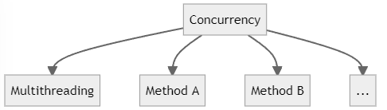
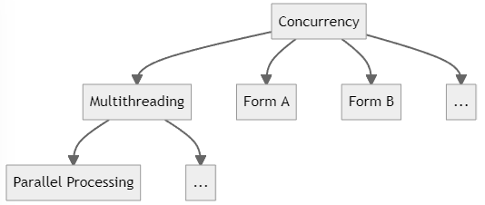
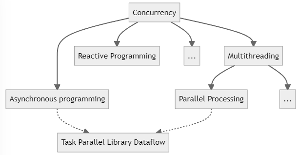

# Concurrency


# 1.Concurrency: An Overview


## 1.1.Introduction to Concurrency

:pushpin:**What is <u>Concurrency</u>?**

Doing more than one thing at a time.


:pushpin:**Concurrency $\neq$ Multithreading**

Multithreading is one form of concurrency, but certainly <u>**not the only one**</u>.




:pushpin:**What is <u>Multithreading</u>?**

A form of concurrency that uses multiple threads of execution.


:pushpin:**Don't use `Thread()`!!**:warning:

`Thread()` is **<u>outdated</u>**. As soon as you type `new Thread()`, it’s over;:skull: your project already has legacy code.


:pushpin:**What is <u>Parallel processing</u>?**

Doing lots of work by dividing it up among multiple threads that run concurrently.


:pushpin:**Relationship so far**




:pushpin:**What is <u>Asynchronous programming</u>?**

A form of concurrency that uses <u>futures</u> or <u>callbacks</u> to **<u>avoid unnecessary threads</u>**.


:pushpin:**What is future?**

A <u>future</u> (or <u>promise</u>) is a type that represents <u>some operation that will complete in the future</u>. Some modern future types in .NET are `Task` and `Task<TResult>`.


:pushpin:**The core of Asynchronous programming**

The core is the idea of an asynchronous operation which is <u>started</u> that will <u>complete some time later</u>.


:pushpin:**What is Reactive Programming?**

A declarative style of programming <u>where the application reacts to events</u>.


:pushpin:**Summary**




:pushpin:**Which technique should we use?**

Generally, most applications use multithreading (via the <u>thread pool</u>) and <u>asynchronous programming</u>.


## 1.2.Introduction to Asynchronous Programming


## 1.3.Introduction to Parallel Programming


## 1.4.Introduction to Reactive Programming (Rx)


## 1.5.Introduction to Dataflows


## 1.6.Introduction to Multithreaded Programming


## 1.7.Modern Design


## 1.8.Summary of Key Technologies


# 2.Async Basics

## 2.1.Pause

**:page_with_curl:Problem**

Need to <u>**pause**</u>(asynchronously) in unit testing or implementing retry delays.


**:hammer:Solution**

Use **`Task.Delay()`** which returns a task that completes after the specified time.


> ​	:one:Use `Task.Delay()` to pause manually

```c#
//Suppose I made a function called DelayResult
public class Help
{
    //here I declare a generic async delay method
    public static async Task<T> DelayResult<T>(T result, TimeSpan delay)
    {
        //pause here
        await Task.Delay(delay);
        return result;
    }
}

//Then I can call it in consle like so:
static void Main(string[] args)
{
    Console.WriteLine("Start.");
    
    //DelayResult return a Task<T>, in this case return a Task<int>
    var task = Help.DelayResult<int>(10, TimeSpan.FromSeconds(1));
    
    Console.WriteLine(task.Result);  //you could get the result using `.Result` property
}
```

The output would be:

```c#
Start.
10    //this line will be delayed 1 second from the last line
```


> ​	:two:Use `Task.Delay()` to prevent flooding server with retries by increasing the delays

```c#
// Create a method will retry after 1 second, then after 2 seconds, then 4.
async Task<string> DownloadStringWithRetries(HttpClient client, string uri)
{
    // 1st time failed will delay 1 second
    TimeSpan nextDelay = TimeSpan.FromSeconds(1);
    
    // try 3 times
    for(int i = 0; i != 3; ++i)
    {
        try
        {
            // if get it successfully, return out of this method
            return await client.GetStringAsync(uri);
        }
        catch
        {}
        
        //failed, delay a period of time
        await Task.Delay(nextDelay);
        //increment delay time per try
        nextDelay = nextDelay + nextDelay;
    }
    
    //Try one last time, allowing the error to propagate.
    return await client.GetStringAsync(uri);
}
```

The preceding strategy refers to <u>exponential backoff</u>[^1] while in practice the author recommends [Polly Nuget](https://www.nuget.org/packages/polly/).


> ​	:three:Use `Task.Delay()` to implement a timeout with `CancellationTokenSource`

The strategy is to create **2** tasks, <u>1st</u> is the operation, <u>2nd</u> is the count-down cancellation, if the 1st doesn't manage to do so, 

the 2nd will cancel it.

```c#
async Task<string> DownloadStringWithTimeout(HttpClient client, string uri)
{
    //1.create a token and pass it into a timeout task
    using var cts = new CancellationTokenSource(TimeSpan.FromSeconds(3));
    Task timeoutTask = Task.Delay(Timeout.InfiniteTimeSpan, cts.Token);
    //2.a download task
    Task<string> downloadTask = client.GetStringAsync(uri);
    
    //3.see which task finish first
    Task completedTask = await Task.WhenAny(downloadTask, timeoutTask);
    
    //4.1.check if the 1st finished task is timeout, if so, return null
    if(completedTask == timeoutTask)
    {
        return null;
    }
    
    //4.2.the 1st finished task is NOT timeout, return the downloadTask
    return await downloadTask;
}
```

The preceding is called "soft time-out":warning: which merely <u>return</u> `null` and <u>ignore</u> the `downloadTask`(it may still download in backend). It does NOT cancel the `GetStringAsync(uri)` itself which can be called "hard time-out"!! 


**:speech_balloon:Discussion**

| Application                    | `Task.Delay()`     | `CancellationToken` |
| ------------------------------ | ------------------ | ------------------- |
| unit testing asynchronous code | :heavy_check_mark: |                     |
| implementing retry logic       | :heavy_check_mark: |                     |
| implement a timeout            | :no_mouth:         | :heavy_check_mark:  |


**:books:See Also**


## 2.2.Return Completed Tasks


**:page_with_curl:Problem**


**:hammer:Solution**


**:speech_balloon:Discussion**


**:books:See Also**


# 3.Asynchronous Streams


**:page_with_curl:Problem**


**:hammer:Solution**


**:speech_balloon:Discussion**


**:books:See Also**


# 4.Parallel Basics


**:page_with_curl:Problem**


**:hammer:Solution**


**:speech_balloon:Discussion**


**:books:See Also**


# 5.Dataflow Basics


**:page_with_curl:Problem**


**:hammer:Solution**


**:speech_balloon:Discussion**


**:books:See Also**


# 6.System.Reactive Basics


**:page_with_curl:Problem**


**:hammer:Solution**


**:speech_balloon:Discussion**


**:books:See Also**


# 7.Testing


**:page_with_curl:Problem**


**:hammer:Solution**


**:speech_balloon:Discussion**


**:books:See Also**


# 8.Interop


**:page_with_curl:Problem**


**:hammer:Solution**


**:speech_balloon:Discussion**


**:books:See Also**


# 9.Collections


**:page_with_curl:Problem**


**:hammer:Solution**


**:speech_balloon:Discussion**


**:books:See Also**


# 10.Cancellation


**:page_with_curl:Problem**


**:hammer:Solution**


**:speech_balloon:Discussion**


**:books:See Also**


# 11.Functional-Friendly OOP


**:page_with_curl:Problem**


**:hammer:Solution**


**:speech_balloon:Discussion**


**:books:See Also**


# 12.Synchronization


**:page_with_curl:Problem**


**:hammer:Solution**


**:speech_balloon:Discussion**


**:books:See Also**


# 13.Scheduling


**:page_with_curl:Problem**


**:hammer:Solution**


**:speech_balloon:Discussion**


**:books:See Also**


# 14.Scenarios


**:page_with_curl:Problem**


**:hammer:Solution**


**:speech_balloon:Discussion**


**:books:See Also**


# End

[^1]: 指数退避策略，https://en.wikipedia.org/wiki/Exponential_backoff

