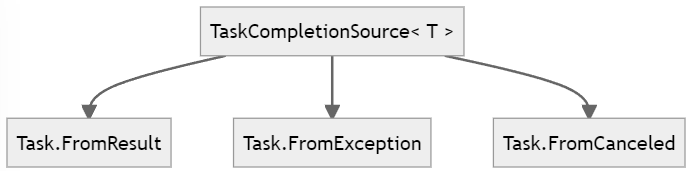

# Concurrency


# 1.Concurrency: An Overview


## 1.1.Introduction to Concurrency

:pushpin:**What is <u>Concurrency</u>?**

Doing more than one thing at a time.


:pushpin:**Concurrency $\neq$ Multithreading**

Multithreading is one form of concurrency, but certainly <u>**not the only one**</u>.


:pushpin:**What is <u>Multithreading</u>?**

A form of concurrency that uses multiple threads of execution.


:pushpin:**Don't use `Thread()`!!**:warning:

`Thread()` is **<u>outdated</u>**. As soon as you type `new Thread()`, it’s over;:skull: your project already has legacy code.


:pushpin:**What is <u>Parallel processing</u>?**

Doing lots of work by dividing it up among multiple threads that run concurrently.


:pushpin:**Relationship so far**


:pushpin:**What is <u>Asynchronous programming</u>?**

A form of concurrency that uses <u>futures</u> or <u>callbacks</u> to **<u>avoid unnecessary threads</u>**.


:pushpin:**What is future?**

A <u>future</u> (or <u>promise</u>) is a type that represents <u>some operation that will complete in the future</u>. Some modern future types in .NET are `Task` and `Task<TResult>`.


:pushpin:**The core of Asynchronous programming**

The core is the idea of an asynchronous operation which is <u>started</u> that will <u>complete some time later</u>.


:pushpin:**What is Reactive Programming?**

A declarative style of programming <u>where the application reacts to events</u>.


:pushpin:**Summary**


:pushpin:**Which technique should we use?**

Generally, most applications use multithreading (via the <u>thread pool</u>) and <u>asynchronous programming</u>.


## 1.2.Introduction to Asynchronous Programming


## 1.3.Introduction to Parallel Programming


## 1.4.Introduction to Reactive Programming (Rx)


## 1.5.Introduction to Dataflows


## 1.6.Introduction to Multithreaded Programming


## 1.7.Modern Design


## 1.8.Summary of Key Technologies


# 2.Async Basics

## 2.1.Pause

**:page_with_curl:Problem**

Need to <u>**pause**</u>(asynchronously) in unit testing or implementing retry delays.


**:hammer:Solution**

Use **`Task.Delay()`** which returns a task that completes after the specified time.


> ​	:one:Use `Task.Delay(TimeSpan)` to pause manually

```c#
//Suppose I made a function called DelayResult
public class Help
{
    //here I declare a generic async delay method
    public static async Task<T> DelayResult<T>(T result, TimeSpan delay)
    {
        //pause here
        await Task.Delay(delay);
        return result;
    }
}

//Then I can call it in consle like so:
static void Main(string[] args)
{
    Console.WriteLine("Start.");
    
    //DelayResult return a Task<T>, in this case return a Task<int>
    var task = Help.DelayResult<int>(10, TimeSpan.FromSeconds(1));
    
    Console.WriteLine(task.Result);  //you could get the result using `.Result` property
}
```

The output would be:

```c#
Start.
10    //this line will be delayed 1 second from the last line
```


> ​	:two:Use `Task.Delay(TimeSpan)` to prevent flooding server with retries by increasing the delays

```c#
// Create a method will retry after 1 second, then after 2 seconds, then 4.
async Task<string> DownloadStringWithRetries(HttpClient client, string uri)
{
    // 1st time failed will delay 1 second
    TimeSpan nextDelay = TimeSpan.FromSeconds(1);
    
    // try 3 times
    for(int i = 0; i != 3; ++i)
    {
        try
        {
            // if get it successfully, return out of this method
            return await client.GetStringAsync(uri);
        }
        catch
        {}
        
        //failed, delay a period of time
        await Task.Delay(nextDelay);
        //increment delay time per try
        nextDelay = nextDelay + nextDelay;
    }
    
    //Try one last time, allowing the error to propagate.
    return await client.GetStringAsync(uri);
}
```

The preceding strategy refers to <u>exponential backoff</u>[^1] while in practice the author recommends [Polly Nuget](https://www.nuget.org/packages/polly/).


> ​	:three:Use `Task.Delay(TimeSpan, CancellationToken)` to implement a timeout with `CancellationTokenSource`

The strategy is to create **2** tasks, <u>1st</u> is the operation, <u>2nd</u> is the count-down cancellation, if the 1st doesn't manage to do so, 

the 2nd will cancel it.

```c#
async Task<string> DownloadStringWithTimeout(HttpClient client, string uri)
{
    //1.create a token and pass it into a timeout task
    using var cts = new CancellationTokenSource(TimeSpan.FromSeconds(3));
    Task timeoutTask = Task.Delay(Timeout.InfiniteTimeSpan, cts.Token);
    //2.a download task
    Task<string> downloadTask = client.GetStringAsync(uri);
    
    //3.see which task finish first
    Task completedTask = await Task.WhenAny(downloadTask, timeoutTask);
    
    //4.1.check if the 1st finished task is timeout, if so, return null
    if(completedTask == timeoutTask)
    {
        return null;
    }
    
    //4.2.the 1st finished task is NOT timeout, return the downloadTask
    return await downloadTask;
}
```

The preceding is called "soft time-out":warning: which merely <u>return</u> `null` and <u>ignore</u> the `downloadTask`(it may still download in backend). It does NOT cancel the `GetStringAsync(uri)` itself which can be called "hard time-out"!! 


**:speech_balloon:Discussion**

| Application                    | `Task.Delay()`     | `CancellationToken` |
| ------------------------------ | ------------------ | ------------------- |
| unit testing asynchronous code | :heavy_check_mark: |                     |
| implementing retry logic       | :heavy_check_mark: |                     |
| implement a timeout            | :no_mouth:         | :heavy_check_mark:  |


**:books:See Also**


## 2.2.Return Completed Task

**:page_with_curl:Problem**

The following situations you might need to return a completed task.

- the signature of the method is `async`, while the implementation or inner method is *synchronous*.
- the `interface` is `async`, while the implementation or inner method is *synchronous*.
- unit testing asynchronous code for an `async` interface.


**:hammer:Solution**

Use:

- :one:`Task<T>` for those methods with the specified return value
- :two:`Task.CompletedTask` property for `void` method
- :three:`Task.FromException(Exception)` for return an exception
- :four:`Task.FromCanceled` to return canceled task


> ​	`Task.FromResult<TResult>(TResult)`

```c#
//Suppose you have an interface like so
interface IMyAsyncInterface
{
    Task<int> GetValueAsync();
}

//A class implement
class MySynchronousImplementation : IMyAsyncInterface
{
    public Task<int> GetValueAsync()
    {
        //here is some synchronous logic
        int myNum = 28;
        ...
        return Task.FromResult(myNum);
    }
}
```


> ​	`Task.CompletedTask` Property

```c#
//Suppose you have an interface like so
interface IMyAsyncInterface
{
    Task DoSomethingAsync();
}

class MySynchronousImplementation : IMyAsyncInterface
{
    public Task DoSomethingAsync()
    {
        //here is some synchronous logic
        ...
        return Task.CompletedTask;
    }
}
```


> ​	`Task.FromException(Exception)`

```c#
class MySynchronousImplementation : IMyAsyncInterface
{
    public Task DoSomethingAsync()
    {
    	try
        {
            //synchronous logic here
            DoSomethingSynchronously();
            return Task.CompletedTask;
    	}
        catch (Exception ex)
        {
            //If synchronous failed, return task with exception
        	return Task.FromException(ex);
        }
    }
}
```


> ​	`Task.FromCanceled(CancellationToken)`

```c#
Task<int> GetValueAsync(CancellationToken ct)
{
    if(ct.IsCancellationRequested)
    {
        return Task.FromCanceled<int>(ct);
    }
    
    //if it is not canceled
    return Task.FromResult(13);
}
```


**:speech_balloon:Discussion**

> ​	Conclusion and Summary



`Task.FromResult`, `Task.FromException`, and `Task.FromCanceled` are all **<u>helper methods</u>** and <u>**shortcuts**</u> for the general-purpose `TaskCompletionSource<T>`.


> ​	Singleton for a frequently used value

```c#
//this is the singleton of a task which merely returns a value(0)
private static readonly Task<int> zeroTask = Task.FromResult(0);
Task<int> GetValueAsync()
{
	return zeroTask;
}
```


**:books:See Also**


## 2.3. Report Progress

**:page_with_curl:Problem**

Report progress while an operation is executing.


**:hammer:Solution**

Use `IProgress<T>` and `Progress<T>`

```c#
//implement a method can report progress
async Task MyMethodAsync(IProgress<double> progress = null)
{
    bool done = false;
    double percentComplete = 0;
    while(!done)
    {
        ...
        progress?.Report(percentComplete);
    }
}

//call the function and listen its progress
async Task CallMyMethodAsync()
{
    var progress = new Progress<double>();
    progress.ProgressChanged += (senser, args) =>
    {
        ...
    };
    await MyMethodAsync(progress);
}
```


//TODO add an example in WPF


**:speech_balloon:Discussion**

$\because$  `IProgress<T>.Report` method is usually <u>**asynchronous**</u>

$\therefore$  `MyMethodAsync` may execute ahead of report

$\therefore$  it is safer to use **value-type** of `<T>`.


**:books:See Also**


## 2.4.Wait Tasks to Complete

**:page_with_curl:Problem**

Need to wait for all `Task` to complete.


**:hammer:Solution**

Use **`Task.WhenAll()`** takes several tasks and <u>returns</u> a task that completes <u>when all of those tasks have completed</u>.


> ​	:one:`Task.WhenAll(Task[])`
>
> ​     	<u>input</u>: several tasks 
>
> ​		 <u>return</u>: a task that completes when all of those tasks have completed

```c#
Task task1 = Task.Delay(TimeSpan.FromSeconds(1));
Task task2 = Task.Delay(TimeSpan.FromSeconds(2));
Task task3 = Task.Delay(TimeSpan.FromSeconds(1));

await Task.WhenAll(task1, task2, task3);
```


> ​	:two:`Task.WhenAll<TResult>(Task<TResult>[])`
>
> ​		 <u>input</u>: same `<TResult>` type tasks
>
> ​		 <u>return</u>: an <u>**array**</u> containing <u>all the tasks result</u>

```c#
public static async void DoSomething()
{
    //Task.FromResult() is merely a method which returns
    //a task with a TResult from the input
    Task<int> task1 = Task.FromResult(20);
    Task<int> task2 = Task.FromResult(30);
    //Task.FromResult() is no difference from the following
    Task<int> task3 = Task.Run(() =>
                               {
                                   int num = 10;
                                   return num;
                               });

    //you can acquire all the result by one task
    int[] result = await Task.WhenAll(task1, task2, task3);

    foreach(var i in result)
    {
        Console.WriteLine(i);
    }
}
```

If run `DoSomething()`, the output will be:

```
10
20
30
```


> ​	:three:`Task.WhenAll(IEnumerable<Task>)`  :x: not recommended

The author does not recommend this overload method. Instead, you can do it with **LINQ** inside the method like so:

```c#
async Task<string> DownloadAllAsync(HttpClient) client, IEnumerable<string> urls)
{
    // Define the action to do for each URL.
    // GetStringAsync() returns Task<string>
    var downloads = urls.Select(url => client.GetStringAsync(url));
    
    // !!!Note that no tasks have actually started yet!!!
	// !!!because the sequence is not evaluated.!!!
    
    // Start all URLs downloading simultaneously.
    Task<string>[] downloadTasks = downloads.ToArray();
    //  Now the tasks have all started.
    
    // Asynchronously wait for all downloads to complete.
    string[] htmlPage = await Task.WhenAll(downloadTasks);
    
    //  return ONE concrete string from asynchronously downloaded pages
    return string.Concat(htmlPages);
}
```


**:speech_balloon:Discussion**

**<u>Question</u>**: As `Task.WhenAll()` handles every tasks, what should it do when encounters `Exception`?

The **<u>answer</u>** is: It’s usually sufficient to respond to <u>only the first error</u> that was thrown.

Suppose you have 2 `Task`:

```c#
// the following 2 Task merely are created to throw exception
async Task ThrowNotImplementedExceptionAsync()
{
    throw new NotImplementedException();
}

async Task ThrowInvalidOperationExceptionAsync()
{
    throw new InvalidOperationException();
}
```

> ​	:one:Respond to 1st error (recommend, sufficient):ok::heavy_check_mark:

```c#
async Task ObserveOneExceptionAsync()
{
    var task1 = ThrowNotImplementedExceptionAsync();
    var task2 = ThrowInvalidOperationExceptionAsync();
    
    try
    {
        await Task.WhenAll(task1, task2);
    }
    catch(Exception ex)
    {
        //ex is either NotImplementedException or InvalidOperationException
    }
}
```

> ​	:two:Aggregate exceptions (OK):ok:

```c#
async Task ObserverAllExceptionAsync()
{
    var task1 = ThrowNotImplementedExceptionAsync();
    var task2 = ThrowInvalidOperationExceptionAsync();
    
    Task allTasks = Task.WhenAll(task1, task2);
    try
    {
        await allTasks;
    }
    catch
    {
        AggregateException allExceptions = allTasks.Exception;
    }
}
```


**:books:See Also**

What is `Task.FromResult()` exactly?

https://ianvink.wordpress.com/2018/04/06/c-using-task-fromresult-to-wrap-a-value-when-there-is-no-task/

https://stackoverflow.com/questions/19568280/what-is-the-use-for-task-fromresulttresult-in-c-sharp


# 3.Asynchronous Streams


**:page_with_curl:Problem**


**:hammer:Solution**


**:speech_balloon:Discussion**


**:books:See Also**


# 4.Parallel Basics


**:page_with_curl:Problem**


**:hammer:Solution**


**:speech_balloon:Discussion**


**:books:See Also**


# 5.Dataflow Basics


**:page_with_curl:Problem**


**:hammer:Solution**


**:speech_balloon:Discussion**


**:books:See Also**


# 6.System.Reactive Basics


**:page_with_curl:Problem**


**:hammer:Solution**


**:speech_balloon:Discussion**


**:books:See Also**


# 7.Testing


**:page_with_curl:Problem**


**:hammer:Solution**


**:speech_balloon:Discussion**


**:books:See Also**


# 8.Interop


**:page_with_curl:Problem**


**:hammer:Solution**


**:speech_balloon:Discussion**


**:books:See Also**


# 9.Collections


**:page_with_curl:Problem**


**:hammer:Solution**


**:speech_balloon:Discussion**


**:books:See Also**


# 10.Cancellation


**:page_with_curl:Problem**


**:hammer:Solution**


**:speech_balloon:Discussion**


**:books:See Also**


# 11.Functional-Friendly OOP


**:page_with_curl:Problem**


**:hammer:Solution**


**:speech_balloon:Discussion**


**:books:See Also**


# 12.Synchronization


**:page_with_curl:Problem**


**:hammer:Solution**


**:speech_balloon:Discussion**


**:books:See Also**


# 13.Scheduling


**:page_with_curl:Problem**


**:hammer:Solution**


**:speech_balloon:Discussion**


**:books:See Also**


# 14.Scenarios


**:page_with_curl:Problem**


**:hammer:Solution**


**:speech_balloon:Discussion**


**:books:See Also**


# End

[^1]: 指数退避策略，https://en.wikipedia.org/wiki/Exponential_backoff

