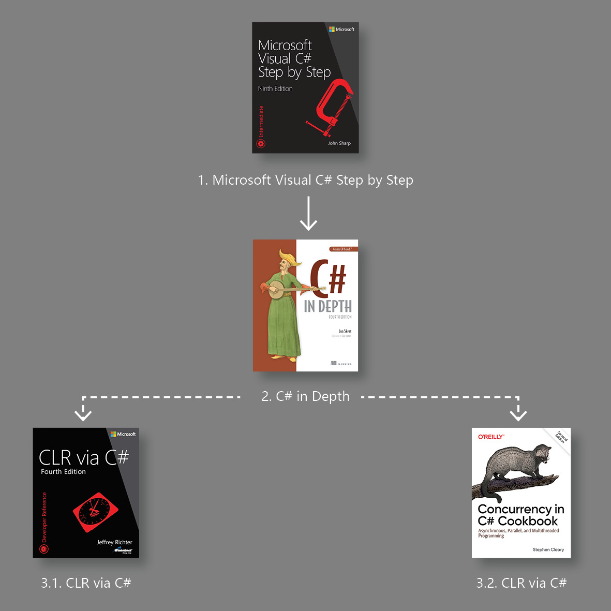

#  C# Notes:notebook_with_decorative_cover: Overview
The notes when I learned C#. It could also be a reference manual applied to daily basis.

`Quick Reference` is for you to recall the knowledge at once.

`Complete Notes` is for you to check the details.

# Table of Content

- Overview
- Recommend Books
- Notes
  - Microsoft Visual C# Step by Step
  - C# in Depth
  - CLR via C#
  - Concurrency in C# Cookbook

# Learning Path

<figure>
  
</figure>

# Recommend Books

| Book                             | Image                                                        | Level              |
| -------------------------------- | ------------------------------------------------------------ | ------------------ |
| Microsoft Visual C# Step by Step |  | :star:             |
| C# in Depth                      |  | :star::star:       |
| CLR via C#                       |  | :star::star::star: |

